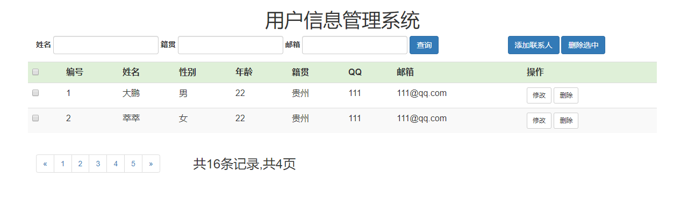
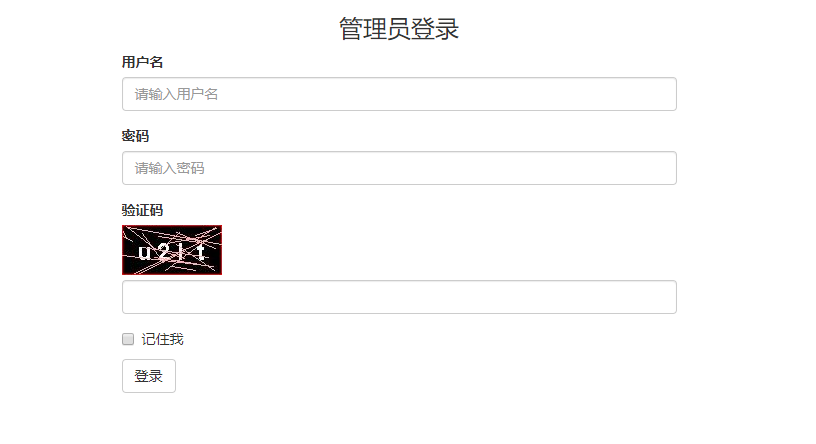
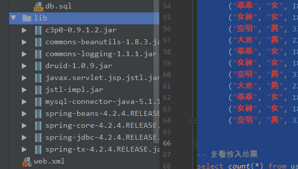
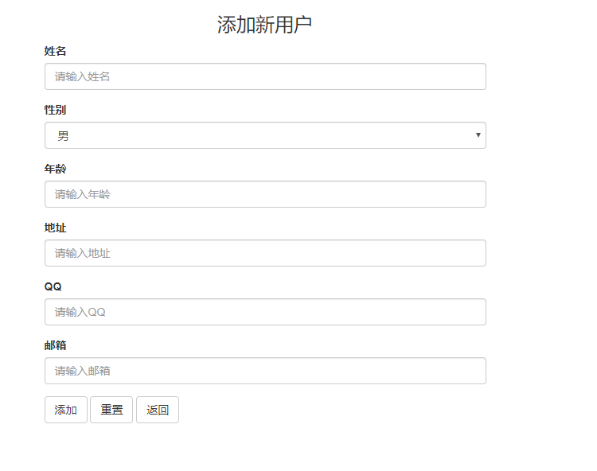

# 理想国Java学生信息管理系统实战教程


>   作者: 张大鹏
>
>   版权: 归张大鹏个人所有,侵权必究
>
>   报名: 欢迎联系我学习Python,Java,C#,`PHP`,GO等编程
>
>   微信: 18010070052
>
>   抖音: `lxgzhw`
>
>   `GitHub`地址: https://github.com/lxgzhw520


## 01.首页布局

1.需求,制作如图所示的页面




2.实战源码

```jsp
<%--
  编辑器: IntelliJ IDEA.
  作者: 理想国真恵玩-张大鹏
  日期: 2019/11/23
  时间: 20:18
--%>
<%@ page contentType="text/html;charset=UTF-8" language="java" %>
<html>
<head>
    <title>理想国学生信息管理系统</title>
    <!-- 最新版本的 Bootstrap 核心 CSS 文件 -->
    <link rel="stylesheet" href="https://cdn.jsdelivr.net/npm/bootstrap@3.3.7/dist/css/bootstrap.min.css"
          integrity="sha384-BVYiiSIFeK1dGmJRAkycuHAHRg32OmUcww7on3RYdg4Va+PmSTsz/K68vbdEjh4u" crossorigin="anonymous">
</head>
<body>

<%--主体部分开始--%>
<div id="main">
    <div class="container">
        <div class="row"><h1 class="text-center">用户信息管理系统</h1></div>
        <div class="row">
            <div class="col-md-9">
                <form class="form-inline mb-2">
                    <div class="form-group">
                        <label for="name">姓名</label>
                        <input type="text" class="form-control" id="name">
                    </div>
                    <div class="form-group mx-sm-3 mb-2">
                        <label for="address">籍贯</label>
                        <input type="text" class="form-control" id="address">
                    </div>
                    <div class="form-group mx-sm-3 mb-2">
                        <label for="email">邮箱</label>
                        <input type="email" class="form-control" id="email">
                    </div>

                    <button type="submit" class="btn btn-primary mb-2">查询</button>
                </form>
            </div>
            <div class="col-md-3">
                <a href="" class="btn btn-primary">添加联系人</a>
                <a href="" class="btn btn-primary">删除选中</a>
            </div>
        </div>

        <%--表格--%>
        <div class="row">
            <table class="table table-striped">
                <tr class="bg-success">
                    <th class="bg-success">
                        <input type="checkbox">
                    </th>
                    <th class="bg-success">编号</th>
                    <th class="bg-success">姓名</th>
                    <th class="bg-success">性别</th>
                    <th class="bg-success">年龄</th>
                    <th class="bg-success">籍贯</th>
                    <th class="bg-success">QQ</th>
                    <th class="bg-success">邮箱</th>
                    <th class="bg-success">操作</th>
                </tr>
                <tr>
                    <td>
                        <input type="checkbox">
                    </td>
                    <td>1</td>
                    <td>大鹏</td>
                    <td>男</td>
                    <td>22</td>
                    <td>贵州</td>
                    <td>111</td>
                    <td>111@qq.com</td>
                    <td>
                        <a href="" class="btn btn-default btn-sm">修改</a>
                        <a href="" class="btn btn-default btn-sm">删除</a>
                    </td>
                </tr>
                <tr>
                    <td>
                        <input type="checkbox">
                    </td>
                    <td>2</td>
                    <td>萃萃</td>
                    <td>女</td>
                    <td>22</td>
                    <td>贵州</td>
                    <td>111</td>
                    <td>111@qq.com</td>
                    <td>
                        <a href="" class="btn btn-sm btn-default">修改</a>
                        <a href="" class="btn btn-sm btn-default">删除</a>
                    </td>
                </tr>
            </table>
        </div>

        <%--分页--%>
        <div class="row">
            <div class="col-md-3">
                <nav aria-label="Page navigation">
                    <ul class="pagination">
                        <li>
                            <a href="#" aria-label="Previous">
                                <span aria-hidden="true">&laquo;</span>
                            </a>
                        </li>
                        <li><a href="#">1</a></li>
                        <li><a href="#">2</a></li>
                        <li><a href="#">3</a></li>
                        <li><a href="#">4</a></li>
                        <li><a href="#">5</a></li>
                        <li>
                            <a href="#" aria-label="Next">
                                <span aria-hidden="true">&raquo;</span>
                            </a>
                        </li>
                    </ul>
                </nav>
            </div>
            <div class="col-md-9">
                <div class="center-block" style="line-height: 316%;font-size: 24px;">共16条记录,共4页</div>
            </div>
        </div>
    </div>
</div>
<%--主体部分结束--%>

<script src="https://cdn.jsdelivr.net/npm/bootstrap@3.3.7/dist/js/bootstrap.min.js"
        integrity="sha384-Tc5IQib027qvyjSMfHjOMaLkfuWVxZxUPnCJA7l2mCWNIpG9mGCD8wGNIcPD7Txa"
        crossorigin="anonymous"></script>
</body>
</html>
```


## 02.登录页面

1.需求:制作如图所示页面,并实现点击验证码切换的功能




2.实战源码

```html
<%--
  编辑器: IntelliJ IDEA.
  作者: 理想国真恵玩-张大鹏
  日期: 2019/11/23
  时间: 21:08
--%>
<%@ page contentType="text/html;charset=UTF-8" language="java" %>
<html>
<head>
    <title>登录页面</title>
    <link rel="stylesheet" href="https://cdn.jsdelivr.net/npm/bootstrap@3.3.7/dist/css/bootstrap.min.css"
          integrity="sha384-BVYiiSIFeK1dGmJRAkycuHAHRg32OmUcww7on3RYdg4Va+PmSTsz/K68vbdEjh4u" crossorigin="anonymous">
</head>
<body>
<div class="container">
    <div class="row">
        <h3 class="text-center">管理员登录</h3>
    </div>
    <div class="row">
        <div class="col-md-6 col-md-offset-3">
            <form action="/ServletLogin" method="post">
                <div class="form-group">
                    <label for="username">用户名</label>
                    <input type="text" class="form-control" id="username" placeholder="请输入用户名" name="username">
                    <p class="help-block">${checkCodeError}</p>
                </div>
                <div class="form-group">
                    <label for="password">密码</label>
                    <input type="password" class="form-control" id="password" placeholder="请输入密码" name="password">
                    <p class="help-block">${checkCodeError}</p>
                </div>
                <div class="form-group">
                    <label for="checkCode">验证码</label><br>
                    
                    <input class="form-control" type="text" id="checkCode" name="checkCode">
                    <p class="help-block">${checkCodeError}</p>
                </div>
                <div class="checkbox">
                    <label>
                        <input type="checkbox" name="remember"> 记住我
                    </label>
                </div>
                <button type="submit" class="btn btn-default">登录</button>
            </form>
        </div>
    </div>
</div>
<script>
    window.onload = function (ev) {
        document.getElementById("checkCodeImg").onclick = function (ev1) {
            this.src = "/ServletCheckCode?date=" + new Date()
        }
    }
</script>
</body>
</html>
```


## 03.准备数据

1.需求

-   数据库创建管理员表和用户信息表,并填充一些数据


2.实战源码

```sql
-- 创建管理员表
show tables;

drop table if exists admin;

create table admin
(
    id       int primary key auto_increment,
    username varchar(24) not null,
    password varchar(72) not null
) engine = innodb
  charset = utf8;

-- 向管理员表插入几条数据
insert into admin(username, password)
values ("lxgzhw", "lxgzhw");

-- 查询插入结果
select *
from admin;

-- 创建用户信息表
-- 	姓名	性别	年龄	籍贯	QQ	邮箱
drop table if exists userinfo;
create table userinfo
(
    id      bigint primary key auto_increment,
    name    varchar(24) not null,
    gender  char(1)     not null,
    age     smallint    not null,
    address varchar(24),
    qq      varchar(11),
    email   varchar(72)
) engine = innodb
  charset = utf8;

-- 查看是否创建成功
show tables;
-- 多插入一些数据
insert into userinfo(name, gender, age, address, qq, email)
values ("大鹏", "男", 22, "贵州", "111", "111@qq.com"),
       ("萃萃", "女", 18, "重庆", "222", "222@qq.com"),
       ("女神", "女", 18, "重庆", "222", "222@qq.com"),
       ("空明", "男", 33, "异世大陆", "666", "666@qq.com"),
       ("大鹏", "男", 22, "贵州", "111", "111@qq.com"),
       ("萃萃", "女", 18, "重庆", "222", "222@qq.com"),
       ("女神", "女", 18, "重庆", "222", "222@qq.com"),
       ("空明", "男", 33, "异世大陆", "666", "666@qq.com"),
       ("大鹏", "男", 22, "贵州", "111", "111@qq.com"),
       ("萃萃", "女", 18, "重庆", "222", "222@qq.com"),
       ("女神", "女", 18, "重庆", "222", "222@qq.com"),
       ("空明", "男", 33, "异世大陆", "666", "666@qq.com"),
       ("大鹏", "男", 22, "贵州", "111", "111@qq.com"),
       ("萃萃", "女", 18, "重庆", "222", "222@qq.com"),
       ("女神", "女", 18, "重庆", "222", "222@qq.com"),
       ("空明", "男", 33, "异世大陆", "666", "666@qq.com"),
       ("大鹏", "男", 22, "贵州", "111", "111@qq.com"),
       ("萃萃", "女", 18, "重庆", "222", "222@qq.com"),
       ("女神", "女", 18, "重庆", "222", "222@qq.com"),
       ("空明", "男", 33, "异世大陆", "666", "666@qq.com"),
       ("大鹏", "男", 22, "贵州", "111", "111@qq.com"),
       ("萃萃", "女", 18, "重庆", "222", "222@qq.com"),
       ("女神", "女", 18, "重庆", "222", "222@qq.com"),
       ("空明", "男", 33, "异世大陆", "666", "666@qq.com");


-- 查看插入结果
select count(*) from userinfo;
```


## 04.搭建JDBC环境

1.需求:要使用java连接数据库,需要配置环境,完成配置

-   1.1 导入依赖包
-   1.2 导入DruidUtils连接池工具类
-   1.3 写一个测试文件进行测试


2.导入包




3.导入druid.properties配置文件

```properties
driverClassName=com.mysql.jdbc.Driver
url=jdbc:mysql:///db1
username=root
password=root
initialSize=5
maxActive=10
maxWait=3000
```


4.DruidUtils工具类

```java
package com.lxgzhw.utils;

import com.alibaba.druid.pool.DruidDataSourceFactory;

import javax.sql.DataSource;
import java.io.IOException;
import java.io.InputStream;
import java.sql.Connection;
import java.sql.SQLException;
import java.util.Properties;

/**
 * druid连接池工具类
 */
public class DruidUtils {
    private static DataSource dataSource;

    static {
        try {
            //1.加载配置文件
            Properties properties = new Properties();
            InputStream resourceAsStream = DruidUtils.class.getClassLoader()
                    .getResourceAsStream("druid.properties");
            properties.load(resourceAsStream);
            //2.初始化连接池对象
            dataSource = DruidDataSourceFactory.createDataSource(properties);
        } catch (IOException e) {
            e.printStackTrace();
        } catch (Exception e) {
            e.printStackTrace();
        }
    }

    /**
     * 获取连接池对象
     */
    public static DataSource getDataSource() {
        return dataSource;
    }

    /**
     * 获取连接数据库对象
     */
    public static Connection getConnection() throws SQLException {
        return dataSource.getConnection();
    }
}
```


5.连接数据库测试

```java
package com.lxgzhw.test;

import com.lxgzhw.utils.DruidUtils;
import org.junit.Test;

import java.sql.Connection;
import java.sql.PreparedStatement;
import java.sql.ResultSet;
import java.sql.SQLException;

public class ConnectionTest {
    @Test
    public void demo01() throws SQLException {
        //连接数据库测试
        Connection connection = DruidUtils.getConnection();
        String sql = "select *from admin";
        PreparedStatement preparedStatement = connection.prepareStatement(sql);
        ResultSet resultSet = preparedStatement.executeQuery();
        while (resultSet.next()) {
            System.out.println(resultSet.getInt("id"));
            System.out.println(resultSet.getString("username"));
            System.out.println(resultSet.getString("password"));
            System.out.println("-------------------------------");
        }
    }
}
```


## 05.管理员相关类

1.要实现登录功能,我们采用业务和逻辑相分离的思想

-   1.1 创建管理员实体类
-   1.2 创建数据库Admin表的管理类
-   1.3 创建服务类


2.Admin的实体类

```java
package com.lxgzhw.domain;

public class Admin {
    private Integer id;
    private String username;
    private String password;

    public Admin() {
    }

    public Admin(Integer id, String username, String password) {
        this.id = id;
        this.username = username;
        this.password = password;
    }

    public Integer getId() {
        return id;
    }

    public void setId(Integer id) {
        this.id = id;
    }

    public String getUsername() {
        return username;
    }

    public void setUsername(String username) {
        this.username = username;
    }

    public String getPassword() {
        return password;
    }

    public void setPassword(String password) {
        this.password = password;
    }

    @Override
    public String toString() {
        return "Admin{" +
                "id=" + id +
                ", username='" + username + '\'' +
                ", password='" + password + '\'' +
                '}';
    }
}
```


3.AdminDao接口类,规定访问数据库的方法

```java
package com.lxgzhw.dao;

import com.lxgzhw.domain.Admin;

public interface AdminDao {
    /**
     * 登录功能
     */
    Admin login(Admin loginUser);
}
```


4.AdminDaoIpl实现类,实现Admin访问数据库的方法

```java
package com.lxgzhw.dao.impl;

import com.lxgzhw.dao.AdminDao;
import com.lxgzhw.domain.Admin;
import com.lxgzhw.utils.DruidUtils;
import org.springframework.jdbc.core.BeanPropertyRowMapper;
import org.springframework.jdbc.core.JdbcTemplate;

public class AdminDaoImpl implements AdminDao {
    private JdbcTemplate template =
            new JdbcTemplate(DruidUtils.getDataSource());

    @Override
    public Admin login(Admin loginUser) {
        //登录数据库
        String sql = "select *from admin where username=? and password=?";
        Admin admin = template.queryForObject(
                sql,
                new BeanPropertyRowMapper<>(Admin.class),
                loginUser.getUsername(),
                loginUser.getPassword()
        );
        return admin;
    }
}
```


5.AdminDaoImplTest测试类,测试登录方法

```java
package com.lxgzhw.test;

import com.lxgzhw.dao.impl.AdminDaoImpl;
import com.lxgzhw.domain.Admin;
import org.junit.Test;

public class AdminDaoImplTest {
    @Test
    public void demo01() {
        //测试登录方法
        Admin admin = new Admin();
        admin.setUsername("lxgzhw");
        admin.setPassword("lxgzhw");

        AdminDaoImpl adminDao = new AdminDaoImpl();
        Admin login = adminDao.login(admin);
        if (login != null) {
            System.out.println(login);
        }
    }
}
```


## 06.登录功能

1.现在,登录方法已经通过测试了,我们只需要接收登录页面传过来的数据,然后调用登录方法即可

2.login.jsp 修改前端源码

```jsp
<%--
  编辑器: IntelliJ IDEA.
  作者: 理想国真恵玩-张大鹏
  日期: 2019/11/23
  时间: 21:08
--%>
<%@ page contentType="text/html;charset=UTF-8" language="java" %>
<%@ taglib prefix="c" uri="http://java.sun.com/jsp/jstl/core" %>
<html>
<head>
    <title>登录页面</title>
    <link rel="stylesheet" href="https://cdn.jsdelivr.net/npm/bootstrap@3.3.7/dist/css/bootstrap.min.css"
          integrity="sha384-BVYiiSIFeK1dGmJRAkycuHAHRg32OmUcww7on3RYdg4Va+PmSTsz/K68vbdEjh4u" crossorigin="anonymous">
    <style>
        .text-danger {
            color: red;
        }
    </style>
</head>
<body>
<%--判断cookie--%>
<c:if test="${cookie.get('username')!=null}">
    <%response.sendRedirect(request.getContextPath() + "/index.jsp");%>
</c:if>
<div class="container">
    <div class="row">
        <h3 class="text-center">管理员登录</h3>
    </div>
    <div class="row">
        <div class="col-md-6 col-md-offset-3">
            <form action="/ServletLogin" method="post">
                <div class="form-group">
                    <label for="username">用户名</label>
                    <input type="text" class="form-control" id="username" placeholder="请输入用户名" name="username">
                    <p class="help-block text-danger">${loginError}</p>
                </div>
                <div class="form-group">
                    <label for="password">密码</label>
                    <input type="password" class="form-control" id="password" placeholder="请输入密码" name="password">
                    <p class="help-block text-danger">${loginError}</p>
                </div>
                <div class="form-group">
                    <label for="checkCode">验证码</label><br>
                    
                    <input class="form-control" type="text" id="checkCode" name="checkCode">
                    <p class="help-block text-danger">${checkCodeError}</p>
                </div>
                <div class="checkbox">
                    <label>
                        <input type="checkbox" name="remember"> 记住我
                    </label>
                </div>
                <button type="submit" class="btn btn-default">登录</button>
            </form>
        </div>
    </div>
</div>
<script>
    window.onload = function (ev) {
        document.getElementById("checkCodeImg").onclick = function (ev1) {
            this.src = "/ServletCheckCode?date=" + new Date()
        }
    }
</script>
</body>
</html>
```


3.在ServletLogin.java中实现登录功能

```java
package com.lxgzhw.web.servlet;

import com.lxgzhw.dao.impl.AdminDaoImpl;
import com.lxgzhw.domain.Admin;

import javax.servlet.ServletException;
import javax.servlet.annotation.WebServlet;
import javax.servlet.http.*;
import java.io.IOException;

@WebServlet("/ServletLogin")
public class ServletLogin extends HttpServlet {
    protected void doPost(HttpServletRequest request, HttpServletResponse response) throws ServletException, IOException {
        HttpSession session = request.getSession();

        //实现登录的功能
        String username = request.getParameter("username");
        String password = request.getParameter("password");
        String checkCode = request.getParameter("checkCode");
        String remember = request.getParameter("remember");

        //如果设置了七天免登陆,则直接跳转到首页
//        Cookie[] cookies = request.getCookies();
//        if (cookies != null && cookies.length > 0) {
//            for (Cookie cookie : cookies) {
//                //看看有没有username
//                String name = cookie.getName();
//                if ("username".equalsIgnoreCase(name)) {
//                    System.out.println(name);
//                    System.out.println("需要直接跳转到首页");
//                    request.getRequestDispatcher("/index.jsp").forward(request,response);
////                    response.sendRedirect(request.getContextPath() + "/index.jsp");
//                    return;
//                }
//            }
//        }

        //用户名和密码不能为空
        if (!username.isEmpty() && !password.isEmpty()) {
            //清空登录错误
            session.removeAttribute("loginError");
            //判断验证码
            String serverCheckCode = (String) session.getAttribute("serverCheckCode");
            if (serverCheckCode.equalsIgnoreCase(checkCode)) {
                session.removeAttribute("serverCheckCode");
                //验证码正确
                //封装
                Admin admin = new Admin();
                admin.setUsername(username);
                admin.setPassword(password);

                //登录
                AdminDaoImpl adminDao = new AdminDaoImpl();
                Admin login = adminDao.login(admin);
                if (login != null) {
                    //System.out.println(login);
                    session.setAttribute("loginUser", login);
                    //判断是否七天免登陆
                    System.out.println(remember);
                    if (remember != null) {
                        Cookie username1 = new Cookie("username", login.getUsername());
                        //七天免登陆
                        username1.setMaxAge(60 * 60 * 24 * 7);
                        response.addCookie(username1);
//                        response.sendRedirect(request.getContextPath() + "/index.jsp");
                    } else {
//                        response.sendRedirect(request.getContextPath() + "/index.jsp");
                    }
                    response.sendRedirect(request.getContextPath() + "/index.jsp");

                } else {
                    System.out.println("登录失败");
                    session.setAttribute("loginError", "用户名或密码不正确");
                    response.sendRedirect(request.getContextPath() + "/login.jsp");
                }
            } else {
                session.setAttribute("checkCodeError", "验证码不正确");

                //跳转
                //return;
                response.sendRedirect(request.getContextPath() + "/login.jsp");
            }
        } else {
            session.setAttribute("loginError", "用户名或密码不能为空");
            response.sendRedirect(request.getContextPath() + "/login.jsp");
        }

    }

    protected void doGet(HttpServletRequest request, HttpServletResponse response) throws ServletException, IOException {
        this.doPost(request, response);
    }
}
```


4.源码解析


```jsp
<%--判断cookie--%>
<c:if test="${cookie.get('username')!=null}">
    <%response.sendRedirect(request.getContextPath() + "/index.jsp");%>
</c:if>
```

-   从当前项目的cookie中获取username并判断是否为空
-   不为空说明已经登录了,且勾选了七天免登陆的功能,则直接跳转到首页


```js
window.onload = function (ev) {
  document.getElementById("checkCodeImg").onclick = function (ev1) {
    this.src = "/ServletCheckCode?date=" + new Date()
  }
}
```

-   通过给src加一个随机请求参数,实现点击图片时更换验证码的功能


```java
//用户名和密码不能为空
if (!username.isEmpty() && !password.isEmpty()) {
  //清空登录错误
  session.removeAttribute("loginError");
  //判断验证码
  String serverCheckCode = (String) session.getAttribute("serverCheckCode");
  if (serverCheckCode.equalsIgnoreCase(checkCode)) {
    session.removeAttribute("serverCheckCode");
    //验证码正确
    //封装
    Admin admin = new Admin();
    admin.setUsername(username);
    admin.setPassword(password);

    //登录
    AdminDaoImpl adminDao = new AdminDaoImpl();
    Admin login = adminDao.login(admin);
    if (login != null) {
      //System.out.println(login);
      session.setAttribute("loginUser", login);
      //判断是否七天免登陆
      System.out.println(remember);
      if (remember != null) {
        Cookie username1 = new Cookie("username", login.getUsername());
        //七天免登陆
        username1.setMaxAge(60 * 60 * 24 * 7);
        response.addCookie(username1);
        //                        response.sendRedirect(request.getContextPath() + "/index.jsp");
      } else {
        //                        response.sendRedirect(request.getContextPath() + "/index.jsp");
      }
      response.sendRedirect(request.getContextPath() + "/index.jsp");

    } else {
      System.out.println("登录失败");
      session.setAttribute("loginError", "用户名或密码不正确");
      response.sendRedirect(request.getContextPath() + "/login.jsp");
    }
  } else {
    session.setAttribute("checkCodeError", "验证码不正确");

    //跳转
    //return;
    response.sendRedirect(request.getContextPath() + "/login.jsp");
  }
} else {
  session.setAttribute("loginError", "用户名或密码不能为空");
  response.sendRedirect(request.getContextPath() + "/login.jsp");
}
```

-   实现登录校验功能
-   实现验证码校验功能
-   实现七天免登陆功能
-   注意: 设置了cookie以后,是在login.jsp中判断是否免登陆,而不是在ServletLogin.java中判断


## 07.信息展示

1.需求:我们需要将用户信息在首页全部展示出来,之后再做分页


2.UserInfo实体类

```java
package com.lxgzhw.domain;

public class UserInfo {
    // id   name, gender, age, address, qq, email
    private Integer id;
    private String name;
    private String gender;
    private int age;
    private String address;
    private String qq;
    private String email;


    public UserInfo() {
    }

    public UserInfo(Integer id, String name, String gender, int age, String address, String qq, String email) {
        this.id = id;
        this.name = name;
        this.gender = gender;
        this.age = age;
        this.address = address;
        this.qq = qq;
        this.email = email;
    }

    public Integer getId() {
        return id;
    }

    public void setId(Integer id) {
        this.id = id;
    }

    public String getName() {
        return name;
    }

    public void setName(String name) {
        this.name = name;
    }

    public String getGender() {
        return gender;
    }

    public void setGender(String gender) {
        this.gender = gender;
    }

    public int getAge() {
        return age;
    }

    public void setAge(int age) {
        this.age = age;
    }

    public String getAddress() {
        return address;
    }

    public void setAddress(String address) {
        this.address = address;
    }

    public String getQq() {
        return qq;
    }

    public void setQq(String qq) {
        this.qq = qq;
    }

    public String getEmail() {
        return email;
    }

    public void setEmail(String email) {
        this.email = email;
    }

    @Override
    public String toString() {
        return "UserInfo{" +
                "id=" + id +
                ", name='" + name + '\'' +
                ", gender='" + gender + '\'' +
                ", age=" + age +
                ", address='" + address + '\'' +
                ", qq='" + qq + '\'' +
                ", email='" + email + '\'' +
                '}';
    }
}
```


3.UserInfoDao方法接口类

```java
package com.lxgzhw.dao;

import com.lxgzhw.domain.UserInfo;

import java.util.ArrayList;

public interface UserInfoDao {
    /**
     * 获取所有的用户信息,封装到列表中
     */
    ArrayList<UserInfo> list();
}
```


4.UserInfoDaoImpl接口方法实现类

```java
package com.lxgzhw.dao.impl;

import com.lxgzhw.dao.UserInfoDao;
import com.lxgzhw.domain.UserInfo;
import com.lxgzhw.utils.DruidUtils;
import org.springframework.jdbc.core.BeanPropertyRowMapper;
import org.springframework.jdbc.core.JdbcTemplate;

import java.util.ArrayList;
import java.util.List;

public class UserInfoDaoImpl implements UserInfoDao {
    JdbcTemplate template=
            new JdbcTemplate(DruidUtils.getDataSource());
    @Override
    public ArrayList<UserInfo> list() {
        //获取所有的用户信息,封装到列表中
        String sql="select *from userinfo";
        List<UserInfo> userInfoList = template.query(
                sql,
                new BeanPropertyRowMapper<>(UserInfo.class)
        );
        return (ArrayList<UserInfo>) userInfoList;
    }
}
```


5.UserinfoDaoImplTest测试类

```java
package com.lxgzhw.test;

import com.lxgzhw.dao.impl.UserInfoDaoImpl;
import com.lxgzhw.domain.UserInfo;
import org.junit.Test;

import java.util.ArrayList;

public class UserInfoDaoImplTest {
    @Test
    public void demo01() {
        //测试list方法
        UserInfoDaoImpl userInfoDao = new UserInfoDaoImpl();
        ArrayList<UserInfo> list = userInfoDao.list();
        list.stream().forEach(System.out::println);
    }
}
```


6.UserInfoService服务类接口

```java
package com.lxgzhw.service;

import com.lxgzhw.domain.UserInfo;

import java.util.ArrayList;

public interface UserInfoService {
    /**
     * 返回用户信息列表
     */
    ArrayList<UserInfo> list();
}
```


7.UserInfoServiceImpl实现类

```java
package com.lxgzhw.service.impl;

import com.lxgzhw.dao.UserInfoDao;
import com.lxgzhw.dao.impl.UserInfoDaoImpl;
import com.lxgzhw.domain.UserInfo;
import com.lxgzhw.service.UserInfoService;

import java.util.ArrayList;

public class UserInfoServiceImpl implements UserInfoService {
    UserInfoDao userInfoDao = new UserInfoDaoImpl();

    @Override
    public ArrayList<UserInfo> list() {
        return userInfoDao.list();
    }
}
```


8.UserInfoServiceImplTest测试类

```java
package com.lxgzhw.test;

import com.lxgzhw.domain.UserInfo;
import com.lxgzhw.service.UserInfoService;
import com.lxgzhw.service.impl.UserInfoServiceImpl;
import org.junit.Test;

import java.util.ArrayList;

public class UserInfoServiceImplTest {
    UserInfoService userInfoService =
            new UserInfoServiceImpl();

    @Test
    public void demo01() {
        //测试list方法
        ArrayList<UserInfo> list = userInfoService.list();
        list.stream().forEach(System.out::println);
    }
}
```


9.改写index.jsp,将数据渲染出来

```jsp
<%@ page import="com.lxgzhw.service.impl.UserInfoServiceImpl" %>
<%@ page import="com.lxgzhw.domain.UserInfo" %>
<%@ page import="java.util.ArrayList" %><%--
  编辑器: IntelliJ IDEA.
  作者: 理想国真恵玩-张大鹏
  日期: 2019/11/23
  时间: 20:18
--%>
<%@ page contentType="text/html;charset=UTF-8" language="java" %>
<%@ taglib prefix="c" uri="http://java.sun.com/jsp/jstl/core" %>
<html>
<head>
    <title>理想国学生信息管理系统</title>
    <!-- 最新版本的 Bootstrap 核心 CSS 文件 -->
    <link rel="stylesheet" href="https://cdn.jsdelivr.net/npm/bootstrap@3.3.7/dist/css/bootstrap.min.css"
          integrity="sha384-BVYiiSIFeK1dGmJRAkycuHAHRg32OmUcww7on3RYdg4Va+PmSTsz/K68vbdEjh4u" crossorigin="anonymous">
</head>
<body>
<%--调用list方法获取所有的用户数据--%>
<%
    UserInfoServiceImpl userInfoService = new UserInfoServiceImpl();
    ArrayList<UserInfo> userInfoList = userInfoService.list();
    request.setAttribute("userInfoList", userInfoList);
%>

<%--主体部分开始--%>
<div id="main">
    <div class="container">
        <div class="row"><h1 class="text-center">用户信息管理系统</h1></div>
        <div class="row">
            <div class="well bg-warning">
                <%--登录用户提示--%>
                <c:if test="${cookie.get('username')!=null}">
                    <span>${cookie.get('username').value},欢迎您使用本系统!</span>
                </c:if>
                <c:if test="${cookie.get('username')==null}">
                    <span>暂未登录 <a href="${pageContext.request.servletContext}/login.jsp">立即登录?</a></span>
                </c:if>
            </div>
        </div>
        <div class="row">
            <div class="col-md-9">
                <form class="form-inline mb-2">
                    <div class="form-group">
                        <label for="name">姓名</label>
                        <input type="text" class="form-control" id="name">
                    </div>
                    <div class="form-group mx-sm-3 mb-2">
                        <label for="address">籍贯</label>
                        <input type="text" class="form-control" id="address">
                    </div>
                    <div class="form-group mx-sm-3 mb-2">
                        <label for="email">邮箱</label>
                        <input type="email" class="form-control" id="email">
                    </div>

                    <button type="submit" class="btn btn-primary mb-2">查询</button>
                </form>
            </div>
            <div class="col-md-3">
                <a href="" class="btn btn-primary">添加联系人</a>
                <a href="" class="btn btn-primary">删除选中</a>
            </div>
        </div>

        <%--表格--%>
        <div class="row">
            <table class="table table-striped">
                <tr class="bg-success">
                    <th class="bg-success">
                        <input type="checkbox">
                    </th>
                    <th class="bg-success">编号</th>
                    <th class="bg-success">姓名</th>
                    <th class="bg-success">性别</th>
                    <th class="bg-success">年龄</th>
                    <th class="bg-success">籍贯</th>
                    <th class="bg-success">QQ</th>
                    <th class="bg-success">邮箱</th>
                    <th class="bg-success">操作</th>
                </tr>
                <%--渲染用户信息--%>
                <c:if test="${empty userInfoList}">
                    <tr>
                        <td>
                            <input type="checkbox">
                        </td>
                        <td>1</td>
                        <td>大鹏</td>
                        <td>男</td>
                        <td>22</td>
                        <td>贵州</td>
                        <td>111</td>
                        <td>111@qq.com</td>
                        <td>
                            <a href="" class="btn btn-default btn-sm">修改</a>
                            <a href="" class="btn btn-default btn-sm">删除</a>
                        </td>
                    </tr>
                    <tr>
                        <td>
                            <input type="checkbox">
                        </td>
                        <td>2</td>
                        <td>萃萃</td>
                        <td>女</td>
                        <td>22</td>
                        <td>贵州</td>
                        <td>111</td>
                        <td>111@qq.com</td>
                        <td>
                            <a href="" class="btn btn-sm btn-default">修改</a>
                            <a href="" class="btn btn-sm btn-default">删除</a>
                        </td>
                    </tr>
                </c:if>
                <c:if test="${not empty userInfoList}">
                    <c:forEach items="${userInfoList}" var="user" varStatus="i">
                        <tr>
                            <td>
                                <input type="checkbox">
                            </td>
                            <td>${i.count}</td>
                            <td>${user.name}</td>
                            <td>${user.gender}</td>
                            <td>${user.age}</td>
                            <td>${user.address}</td>
                            <td>${user.qq}</td>
                            <td>${user.email}</td>
                            <td>
                                <a href="" class="btn btn-default btn-sm">修改</a>
                                <a href="" class="btn btn-default btn-sm">删除</a>
                            </td>
                        </tr>
                    </c:forEach>
                </c:if>

            </table>
        </div>

        <%--分页--%>
        <div class="row">
            <div class="col-md-3">
                <nav aria-label="Page navigation">
                    <ul class="pagination">
                        <li>
                            <a href="#" aria-label="Previous">
                                <span aria-hidden="true">&laquo;</span>
                            </a>
                        </li>
                        <li><a href="#">1</a></li>
                        <li><a href="#">2</a></li>
                        <li><a href="#">3</a></li>
                        <li><a href="#">4</a></li>
                        <li><a href="#">5</a></li>
                        <li>
                            <a href="#" aria-label="Next">
                                <span aria-hidden="true">&raquo;</span>
                            </a>
                        </li>
                    </ul>
                </nav>
            </div>
            <div class="col-md-9">
                <div class="center-block" style="line-height: 316%;font-size: 24px;">共16条记录,共4页</div>
            </div>
        </div>
    </div>
</div>
<%--主体部分结束--%>

<script src="https://cdn.jsdelivr.net/npm/bootstrap@3.3.7/dist/js/bootstrap.min.js"
        integrity="sha384-Tc5IQib027qvyjSMfHjOMaLkfuWVxZxUPnCJA7l2mCWNIpG9mGCD8wGNIcPD7Txa"
        crossorigin="anonymous"></script>
</body>
</html>
```


10.源码解析


```jsp
<%--调用list方法获取所有的用户数据--%>
<%
    UserInfoServiceImpl userInfoService = new UserInfoServiceImpl();
    ArrayList<UserInfo> userInfoList = userInfoService.list();
    request.setAttribute("userInfoList", userInfoList);
%>
```

-   通过UserInfoServiceImpl的list方法,从数据库获取所有的用户信息


```jsp
<table class="table table-striped">
  <tr class="bg-success">
    <th class="bg-success">
      <input type="checkbox">
    </th>
    <th class="bg-success">编号</th>
    <th class="bg-success">姓名</th>
    <th class="bg-success">性别</th>
    <th class="bg-success">年龄</th>
    <th class="bg-success">籍贯</th>
    <th class="bg-success">QQ</th>
    <th class="bg-success">邮箱</th>
    <th class="bg-success">操作</th>
  </tr>
  <%--渲染用户信息--%>
  <c:if test="${empty userInfoList}">
    <tr>
      <td>
        <input type="checkbox">
      </td>
      <td>1</td>
      <td>大鹏</td>
      <td>男</td>
      <td>22</td>
      <td>贵州</td>
      <td>111</td>
      <td>111@qq.com</td>
      <td>
        <a href="" class="btn btn-default btn-sm">修改</a>
        <a href="" class="btn btn-default btn-sm">删除</a>
      </td>
    </tr>
    <tr>
      <td>
        <input type="checkbox">
      </td>
      <td>2</td>
      <td>萃萃</td>
      <td>女</td>
      <td>22</td>
      <td>贵州</td>
      <td>111</td>
      <td>111@qq.com</td>
      <td>
        <a href="" class="btn btn-sm btn-default">修改</a>
        <a href="" class="btn btn-sm btn-default">删除</a>
      </td>
    </tr>
  </c:if>
  <c:if test="${not empty userInfoList}">
    <c:forEach items="${userInfoList}" var="user" varStatus="i">
      <tr>
        <td>
          <input type="checkbox">
        </td>
        <td>${i.count}</td>
        <td>${user.name}</td>
        <td>${user.gender}</td>
        <td>${user.age}</td>
        <td>${user.address}</td>
        <td>${user.qq}</td>
        <td>${user.email}</td>
        <td>
          <a href="" class="btn btn-default btn-sm">修改</a>
          <a href="" class="btn btn-default btn-sm">删除</a>
        </td>
      </tr>
    </c:forEach>
  </c:if>

</table>
```

-   渲染用户信息
-   如果userInfoList为空,则显示两个固定的信息
-   如果userInfoList不为空,则动态的渲染从数据库加载出来的数据


## 08.添加页面

1.需求,制作如图所示的添加用户界面




2.实战源码

```jsp
<%--
  编辑器: IntelliJ IDEA.
  作者: 理想国真恵玩-张大鹏
  日期: 2019/11/23
  时间: 21:08
--%>
<%@ page contentType="text/html;charset=UTF-8" language="java" %>
<%@ taglib prefix="c" uri="http://java.sun.com/jsp/jstl/core" %>
<html>
<head>
    <title>添加页面</title>
    <link rel="stylesheet" href="https://cdn.jsdelivr.net/npm/bootstrap@3.3.7/dist/css/bootstrap.min.css"
          integrity="sha384-BVYiiSIFeK1dGmJRAkycuHAHRg32OmUcww7on3RYdg4Va+PmSTsz/K68vbdEjh4u" crossorigin="anonymous">
    <style>
        .text-danger {
            color: red;
        }
    </style>
</head>
<body>
<%--如果没有登录,则跳转到登录页面--%>
<c:if test="${cookie.get('username')==null}">
    <%response.sendRedirect(request.getContextPath() + "/login.jsp");%>
</c:if>
<div class="container">
    <div class="row">
        <h3 class="text-center">添加新用户</h3>
    </div>
    <div class="row">
        <div class="col-md-6 col-md-offset-3">
            <form action="/ServletLogin" method="post">
                <%-- // id   name, gender, age, address, qq, email--%>
                <div class="form-group">
                    <label for="name">姓名</label>
                    <input type="text" class="form-control" id="name" placeholder="请输入姓名" name="name">
                    <p class="help-block text-danger">${loginError}</p>
                </div>
                <div class="form-group">
                    <label for="gender">性别</label>
                    <select class="form-control" name="gender" id="gender">
                        <option value="男">男</option>
                        <option value="女">女</option>
                    </select>
                    <p class="help-block text-danger">${loginError}</p>
                </div>
                <div class="form-group">
                    <label for="age">年龄</label>
                    <input type="number" class="form-control" id="age" placeholder="请输入年龄" name="age">
                    <p class="help-block text-danger">${loginError}</p>
                </div>
                <div class="form-group">
                    <label for="address">地址</label>
                    <input type="text" class="form-control" id="address" placeholder="请输入地址" name="address">
                    <p class="help-block text-danger">${loginError}</p>
                </div>
                <div class="form-group">
                    <label for="qq">QQ</label>
                    <input type="text" class="form-control" id="qq" placeholder="请输入QQ" name="qq">
                    <p class="help-block text-danger">${loginError}</p>
                </div>
                <div class="form-group">
                    <label for="email">邮箱</label>
                    <input type="email" class="form-control" id="email" placeholder="请输入邮箱" name="email">
                    <p class="help-block text-danger">${loginError}</p>
                </div>

                <button type="submit" class="btn btn-default">添加</button>
                <button type="reset" class="btn btn-default">重置</button>
                <button type="reset" class="btn btn-default">返回</button>
            </form>
        </div>
    </div>
</div>
</body>
</html>
```


## 09.添加功能

1.需求: 现在,添加页面有了,我们需要实现添加功能,当用户填写数据提交以后,将数据存储到数据库,然后跳转到首页展示


2.在UserInfoDao接口中添加add方法

```java
/**
* 添加用户数据到数据库的方法,返回添加结果
*/
boolean add(UserInfo user);
```


3.在UserInfoDaoImpl中实现添加add的方法

```java
@Override
public boolean add(UserInfo user) {
  //添加user到数据库
  // id   name, gender, age, address, qq, email
  String sql = "insert into userinfo(name, gender, age, address, qq, email) values(?,?,?,?,?,?)";
  int update = template.update(
    sql, user.getName(), user.getGender(), user.getAge(),
    user.getAddress(), user.getQq(), user.getEmail()
  );
  return update > 0;
}
```


4.在UserInfoDaoImplTest中添加测试的方法

```java
@Test
public void addTest() {
  //测试添加的方法
  UserInfo userInfo = new UserInfo();
  userInfo.setName("大黄");
  userInfo.setGender("男");
  userInfo.setAge(100);
  userInfo.setAddress("异世大陆");
  userInfo.setQq("123");
  userInfo.setEmail("123@qq.com");
  boolean add = userInfoDao.add(userInfo);
  System.out.println(add);
}
```


5.在UserInfoService接口中添加add方法

```java
/**
 * 添加用户到数据库
 */
boolean add(UserInfo user);
```


6.在UserInfoServiceImpl中添加add的实现方法

```java
@Override
public boolean add(UserInfo user) {
    return userInfoDao.add(user);
}
```


7.在UserInfoServiceImplTest中添加addTest测试方法

```java
@Test
public void addTest() {
    //测试添加的方法
    UserInfo userInfo = new UserInfo();
    userInfo.setName("大黄");
    userInfo.setGender("男");
    userInfo.setAge(100);
    userInfo.setAddress("异世大陆");
    userInfo.setQq("123");
    userInfo.setEmail("123@qq.com");
    boolean add = userInfoService.add(userInfo);
    System.out.println(add);
}
```


8.添加到数据库的方法测试完毕,设计添加方法的servlet实现类

```java
package com.lxgzhw.web.servlet;

import com.lxgzhw.domain.UserInfo;
import com.lxgzhw.service.impl.UserInfoServiceImpl;
import org.apache.commons.beanutils.BeanUtils;

import javax.servlet.ServletException;
import javax.servlet.annotation.WebServlet;
import javax.servlet.http.HttpServlet;
import javax.servlet.http.HttpServletRequest;
import javax.servlet.http.HttpServletResponse;
import javax.servlet.http.HttpSession;
import java.io.IOException;
import java.lang.reflect.InvocationTargetException;
import java.util.Collection;
import java.util.Map;

@WebServlet("/ServletAdd")
public class ServletAdd extends HttpServlet {
    protected void doPost(HttpServletRequest request, HttpServletResponse response) throws ServletException, IOException {
        HttpSession session = request.getSession();
        //获取用户数据
        request.setCharacterEncoding("utf8");
        Map<String, String[]> parameterMap = request.getParameterMap();
        UserInfo userInfo = new UserInfo();
        try {
            //封装数据
            BeanUtils.populate(userInfo, parameterMap);
        } catch (IllegalAccessException e) {
            e.printStackTrace();
        } catch (InvocationTargetException e) {
            e.printStackTrace();
        }

        //保存
        //判断userinfo是否为空
        System.out.println(userInfo);
        boolean flag = false;
        if (userInfo.getName().isEmpty()) {
            session.setAttribute("addNameError", "用户名不能为空");
            flag = true;
        } else if (userInfo.getAge() == 0) {
            session.setAttribute("addAgeError", "年龄不能为空");
            flag = true;
        }
        if (flag) {
            //遇到错误,就返回
            response.sendRedirect(request.getContextPath() + "/add.jsp");
        } else {
            UserInfoServiceImpl userInfoService = new UserInfoServiceImpl();
            boolean add = userInfoService.add(userInfo);
            if (add) {
                //添加成功
                response.sendRedirect(request.getContextPath() + "/index.jsp");
            } else {
                session.setAttribute("addError", "数据有误,请检查后重新输入");
                response.sendRedirect(request.getContextPath() + "/add.jsp");
            }
        }
    }

    protected void doGet(HttpServletRequest request, HttpServletResponse response) throws ServletException, IOException {
        this.doPost(request, response);
    }
}
```


9.源码解析


```java
//获取用户数据
request.setCharacterEncoding("utf8");
Map<String, String[]> parameterMap = request.getParameterMap();
UserInfo userInfo = new UserInfo();
try {
    //封装数据
    BeanUtils.populate(userInfo, parameterMap);
} catch (IllegalAccessException e) {
    e.printStackTrace();
} catch (InvocationTargetException e) {
    e.printStackTrace();
}
```

-   将用户提交的数据封装到userinfo对象中


```java
//判断userinfo是否为空
System.out.println(userInfo);
boolean flag = false;
if (userInfo.getName().isEmpty()) {
    session.setAttribute("addNameError", "用户名不能为空");
    flag = true;
} else if (userInfo.getAge() == 0) {
    session.setAttribute("addAgeError", "年龄不能为空");
    flag = true;
}
```

-   判断用户提交的是否为空数据,如果为空,则返回到原页面


```java
if (flag) {
    //遇到错误,就返回
    response.sendRedirect(request.getContextPath() + "/add.jsp");
} else {
    UserInfoServiceImpl userInfoService = new UserInfoServiceImpl();
    boolean add = userInfoService.add(userInfo);
    if (add) {
        //添加成功
        response.sendRedirect(request.getContextPath() + "/index.jsp");
    } else {
        session.setAttribute("addError", "数据有误,请检查后重新输入");
        response.sendRedirect(request.getContextPath() + "/add.jsp");
    }
}
```

-   如果不为空,则将数据保存到数据库中


## 10.删除功能

1.添加功能实现了,有时候我们添加了一些不想要的数据,那么该如何去删除这些数据呢?


2.在UserInfoDao接口中添加delete方法

```java
/**
 * 根据id删除用户信息
 */
boolean delete(String id);
```


3.在UserInfoDaoImpl中实现delete方法

```java
@Override
public boolean delete(String id) {
    String sql = "delete from userinfo where id=?";
    int update = template.update(sql, id);
    return update > 0;
}
```


4.在UserInfoDaoImpleTest中添加deleteTest方法进行测试

```java
@Test
public void deleteTest() {
    boolean delete = userInfoDao.delete("1403");
    System.out.println(delete);
}
```


5.在UserInfoService中添加delete方法

```java
/**
 * 从数据库删除用户信息
 */
boolean delete(String id);
```


6.在UserInfoServiceImpl中实现delete方法

```java
@Override
public boolean delete(String id) {
    return userInfoDao.delete(id);
}
```


7.在index.jsp中调用调用删除方法

```jsp
<a href="javascript:deleteUser(${user.id})" class="btn btn-default btn-sm">删除</a>
```

```js
//根据id删除用户
function deleteUser(id) {
    if (confirm("您确定要删除该用户吗?")) {
        //访问路径
        location.href = "${pageContext.request.contextPath}/ServletDeleteUserInfo?id=" + id
    }
}
```

-   注意,js函数要直接写在script标签下


8.写ServletDeleteUserInfo来处理用户的删除请求

```java
package com.lxgzhw.web.servlet;

import com.lxgzhw.service.impl.UserInfoServiceImpl;

import javax.servlet.ServletException;
import javax.servlet.annotation.WebServlet;
import javax.servlet.http.HttpServlet;
import javax.servlet.http.HttpServletRequest;
import javax.servlet.http.HttpServletResponse;
import javax.servlet.http.HttpSession;
import java.io.IOException;

@WebServlet("/ServletDeleteUserInfo")
public class ServletDeleteUserInfo extends HttpServlet {
    protected void doPost(HttpServletRequest request, HttpServletResponse response) throws ServletException, IOException {
        //处理用户的删除请求
        String id = request.getParameter("id");
        UserInfoServiceImpl userInfoService = new UserInfoServiceImpl();
        boolean delete = userInfoService.delete(id);
        if (delete) {
            HttpSession session = request.getSession();
            session.setAttribute("deleteUserInfoError", "删除用户失败");
        }
        response.sendRedirect(request.getContextPath() + "/index.jsp");
    }

    protected void doGet(HttpServletRequest request, HttpServletResponse response) throws ServletException, IOException {
        this.doPost(request, response);
    }
}
```


## 11.修改页面

1.需求:当用户点击修改按钮,会跳转到修改页面,并将原本的信息填写在对应的表单中


2.在UserInfoDao中添加getUserInfoById()的方法

```java
/**
 * 根据id获取用户
 */
UserInfo getUserInfoById(Integer id);
```


3.在UserInfoDaoImpl中实现该方法

```java
@Override
public UserInfo getUserInfoById(Integer id) {
    String sql = "select *from userinfo where id=?";
    UserInfo userInfo = template.queryForObject(sql, new BeanPropertyRowMapper<>(UserInfo.class), id);
    return userInfo;
}
```


4.在UserInfoDaoImplTest中测试该方法

```java
@Test
public void getUserInfoByIdTest() {
    UserInfo userInfoById = userInfoDao.getUserInfoById(1);
    System.out.println(userInfoById);
}
```


5.在UserInfoService中添加该方法

```java
/**
 * 根据id获取用户
 */
UserInfo getUserInfoById(String id);
```


6.在UserInfoServiceImpl中实现该方法

```java
@Override
public UserInfo getUserInfoById(String id) {
    UserInfo userInfoById = userInfoDao.getUserInfoById(Integer.parseInt(id));
    return userInfoById;
}
```


7.修改index.jsp中的修改按钮

```java
<a href="${pageContext.request.contextPath}/ServletUpdateGetUser?id=${user.id}" class="btn btn-default btn-sm">修改</a>
```


8.添加ServletUpdateGetUser,处理请求,回显数据

```java
package com.lxgzhw.web.servlet;

import com.lxgzhw.domain.UserInfo;
import com.lxgzhw.service.impl.UserInfoServiceImpl;

import javax.servlet.ServletException;
import javax.servlet.annotation.WebServlet;
import javax.servlet.http.HttpServlet;
import javax.servlet.http.HttpServletRequest;
import javax.servlet.http.HttpServletResponse;
import java.io.IOException;

@WebServlet("/ServletUpdateGetUser")
public class ServletUpdateGetUser extends HttpServlet {
    protected void doPost(HttpServletRequest request, HttpServletResponse response) throws ServletException, IOException {
        //获取用户信息
        String id = request.getParameter("id");
        UserInfoServiceImpl userInfoService = new UserInfoServiceImpl();
        System.out.println(id);
        UserInfo user = userInfoService.getUserInfoById(id);
        //存储用户
        request.setAttribute("user", user);
        System.out.println(user);
        request.getRequestDispatcher(request.getContextPath() + "/update.jsp").forward(request, response);
    }

    protected void doGet(HttpServletRequest request, HttpServletResponse response) throws ServletException, IOException {
        this.doPost(request, response);
    }
}
```

-   关键技术

```java
request.getRequestDispatcher(request.getContextPath() + "/update.jsp").forward(request, response);
```

-   请求转发


9.在update.jsp中显示数据

```jsp
<%@ page import="com.lxgzhw.service.impl.UserInfoServiceImpl" %>
<%@ page import="com.lxgzhw.domain.UserInfo" %><%--
  编辑器: IntelliJ IDEA.
  作者: 理想国真恵玩-张大鹏
  日期: 2019/11/23
  时间: 21:08
--%>
<%@ page contentType="text/html;charset=UTF-8" language="java" %>
<%@ taglib prefix="c" uri="http://java.sun.com/jsp/jstl/core" %>
<html>
<head>
    <title>修改页面</title>
    <link rel="stylesheet" href="https://cdn.jsdelivr.net/npm/bootstrap@3.3.7/dist/css/bootstrap.min.css"
          integrity="sha384-BVYiiSIFeK1dGmJRAkycuHAHRg32OmUcww7on3RYdg4Va+PmSTsz/K68vbdEjh4u" crossorigin="anonymous">
    <style>
        .text-danger {
            color: red;
        }
    </style>
</head>
<body>
<%--如果没有登录,则跳转到登录页面--%>
<c:if test="${cookie.get('username')==null}">
    <%response.sendRedirect(request.getContextPath() + "/login.jsp");%>
</c:if>
<div class="container">
    <div class="row">
        <h3 class="text-center">添加新用户</h3>
    </div>
    <div class="row">
        <div class="col-md-6 col-md-offset-3">
            <form action="/ServletUpdateUserInfo" method="post">
                <%-- // id   name, gender, age, address, qq, email--%>
                <%--为了方便修改,需要将ID也上传--%>
                <input type="hidden" name="id" value="${user.id}">
                <div class="form-group">
                    <label for="name">姓名</label>
                    <input type="text" class="form-control" id="name" value="${user.name}" name="name">
                </div>
                <div class="form-group">
                    <label for="gender">性别</label>
                    <select class="form-control" name="gender" id="gender">
                        <%--根据数据库,进行选择--%>
                        <c:if test="${user.gender=='男'}">
                            <option value="男" selected>男</option>
                            <option value="女">女</option>
                        </c:if>
                        <c:if test="${user.gender=='女'}">
                            <option value="男">男</option>
                            <option value="女" selected>女</option>
                        </c:if>
                    </select>
                </div>
                <div class="form-group">
                    <label for="age">年龄</label>
                    <input type="number" class="form-control" id="age" value="${user.age}" name="age">
                </div>
                <div class="form-group">
                    <label for="address">地址</label>
                    <input type="text" class="form-control" id="address" value="${user.address}" name="address">
                </div>
                <div class="form-group">
                    <label for="qq">QQ</label>
                    <input type="text" class="form-control" id="qq" value="${user.qq}" name="qq">
                </div>
                <div class="form-group">
                    <label for="email">邮箱</label>
                    <input type="email" class="form-control" id="email" value="${user.email}" name="email">
                </div>
                <button type="submit" class="btn btn-default">添加</button>
                <button type="reset" class="btn btn-default">重置</button>
                <button type="reset" class="btn btn-default">返回</button>
            </form>
        </div>
    </div>
</div>
</body>
</html>
```

-   关键技术

```jsp
<%--为了方便修改,需要将ID也上传--%>
<input type="hidden" name="id" value="${user.id}">
```

-   隐藏域的使用


## 12.修改功能

1.需求:现在修改页面写好了,接下来写修改功能,需要将用户提交的修改数据在数据库层面进行更新


2.在UserInfoDao接口中添加update方法

```java
/**
 * 根据用户实体类对象修改用户在数据库的信息
 */
boolean update(UserInfo user);
```


3.在UserInfoDaoImpl中实现该方法

```java
@Override
public boolean update(UserInfo user) {
    //更新用户的信息
    // id   name, gender, age, address, qq, email
    String sql = "update userinfo set name=?,gender=?,age=?,address=?,qq=?,email=? where id=?";
    int update = template.update(sql, user.getName(), user.getGender(), user.getAge(),
            user.getAddress(), user.getQq(), user.getEmail(), user.getId());
    return update > 0;
}
```


4.在UserInfoDaoImplTest中测试该方法

```java
@Test
public void updateTest() {
    //UserInfo{id=1402, name='lxgzhw002', gender='男', age=25, address='花果山', qq='1156956636', email='lxgzhw002@qq.com'}
    UserInfo userInfo = new UserInfo();
    userInfo.setName("理想国真恵玩");
    userInfo.setId(1402);
    userInfo.setGender("男");
    boolean update = userInfoDao.update(userInfo);
    System.out.println(update);
}
```


5.在UserInfoService中添加该方法

```java
/**
 * 更新用户
 */
boolean update(UserInfo user);
```


6.在UserInfoServiceImpl中实现该方法

```java
@Override
public boolean update(UserInfo user) {
    return userInfoDao.update(user);
}
```


7.在ServletUpdateUserInfo中实现更新功能

```java
package com.lxgzhw.web.servlet;

import com.lxgzhw.domain.UserInfo;
import com.lxgzhw.service.impl.UserInfoServiceImpl;
import org.apache.commons.beanutils.BeanUtils;

import javax.servlet.ServletException;
import javax.servlet.annotation.WebServlet;
import javax.servlet.http.HttpServlet;
import javax.servlet.http.HttpServletRequest;
import javax.servlet.http.HttpServletResponse;
import javax.servlet.http.HttpSession;
import java.io.IOException;
import java.lang.reflect.InvocationTargetException;
import java.util.Map;

@WebServlet("/ServletUpdateUserInfo")
public class ServletUpdateUserInfo extends HttpServlet {
    protected void doPost(HttpServletRequest request, HttpServletResponse response) throws ServletException, IOException {
        //当提交的数据用中文字段的时候,一定不要忘了设置编码
        request.setCharacterEncoding("utf-8");
        //获取用户信息,转发到update.jsp
        Map<String, String[]> parameterMap = request.getParameterMap();
        UserInfo userInfo = new UserInfo();
        try {
            BeanUtils.populate(userInfo, parameterMap);
        } catch (IllegalAccessException e) {
            e.printStackTrace();
        } catch (InvocationTargetException e) {
            e.printStackTrace();
        }
        System.out.println(userInfo);
        //更新
        UserInfoServiceImpl userInfoService = new UserInfoServiceImpl();
        boolean update = userInfoService.update(userInfo);
        if (!update) {
            HttpSession session = request.getSession();
            session.setAttribute("updateUserInfoError", "更新用户信息失败");
        }
        response.sendRedirect(request.getContextPath() + "/index.jsp");
    }

    protected void doGet(HttpServletRequest request, HttpServletResponse response) throws ServletException, IOException {
        this.doPost(request, response);
    }
}
```


## 13.获取被选中

1.需求:接下来要实现删除选中的功能,要实现这个功能,首先要解决的就是如何获取到被选中的表单

2.要实现这个需求,最简单的方案是给所有的checkbox套一个form表单,然后通过form表单提交

3.修改index.jsp中的源码

```jsp
<%@ page import="com.lxgzhw.service.impl.UserInfoServiceImpl" %>
<%@ page import="com.lxgzhw.domain.UserInfo" %>
<%@ page import="java.util.ArrayList" %><%--
  编辑器: IntelliJ IDEA.
  作者: 理想国真恵玩-张大鹏
  日期: 2019/11/23
  时间: 20:18
--%>
<%@ page contentType="text/html;charset=UTF-8" language="java" %>
<%@ taglib prefix="c" uri="http://java.sun.com/jsp/jstl/core" %>
<html>
<head>
    <title>理想国学生信息管理系统</title>
    <!-- 最新版本的 Bootstrap 核心 CSS 文件 -->
    <link rel="stylesheet" href="https://cdn.jsdelivr.net/npm/bootstrap@3.3.7/dist/css/bootstrap.min.css"
          integrity="sha384-BVYiiSIFeK1dGmJRAkycuHAHRg32OmUcww7on3RYdg4Va+PmSTsz/K68vbdEjh4u" crossorigin="anonymous">
</head>
<body>
<%--调用list方法获取所有的用户数据--%>
<%
    UserInfoServiceImpl userInfoService = new UserInfoServiceImpl();
    ArrayList<UserInfo> userInfoList = userInfoService.list();
    request.setAttribute("userInfoList", userInfoList);
%>

<%--主体部分开始--%>
<div id="main">
    <div class="container">
        <div class="row"><h1 class="text-center">用户信息管理系统</h1></div>
        <div class="row">
            <div class="well bg-warning">
                <%--登录用户提示--%>
                <c:if test="${cookie.get('username')!=null}">
                    <span>${cookie.get('username').value},欢迎您使用本系统!</span>
                </c:if>
                <c:if test="${cookie.get('username')==null}">
                    <span>暂未登录 <a href="${pageContext.request.servletContext}/login.jsp">立即登录?</a></span>
                </c:if>
            </div>
        </div>
        <div class="row">
            <div class="col-md-9">
                <form class="form-inline mb-2">
                    <div class="form-group">
                        <label for="name">姓名</label>
                        <input type="text" class="form-control" id="name">
                    </div>
                    <div class="form-group mx-sm-3 mb-2">
                        <label for="address">籍贯</label>
                        <input type="text" class="form-control" id="address">
                    </div>
                    <div class="form-group mx-sm-3 mb-2">
                        <label for="email">邮箱</label>
                        <input type="email" class="form-control" id="email">
                    </div>

                    <button type="submit" class="btn btn-primary mb-2">查询</button>
                </form>
            </div>
            <div class="col-md-3">
                <a href="${pageContext.request.contextPath}/add.jsp" class="btn btn-primary">添加联系人</a>
                <a href="javascript:void(0);" class="btn btn-primary" id="delSelected">删除选中</a>
            </div>
        </div>

        <%--表格--%>
        <div class="row">
            <form action="${pageContext.request.contextPath}/ServletDeleteSelected" id="form"
                  method="post">
                <table class="table table-striped">
                    <tr class="bg-success">
                        <th class="bg-success">
                            <input type="checkbox" id="selectAll">
                        </th>
                        <th class="bg-success">编号</th>
                        <th class="bg-success">姓名</th>
                        <th class="bg-success">性别</th>
                        <th class="bg-success">年龄</th>
                        <th class="bg-success">籍贯</th>
                        <th class="bg-success">QQ</th>
                        <th class="bg-success">邮箱</th>
                        <th class="bg-success">操作</th>
                    </tr>
                    <%--渲染用户信息--%>
                    <c:if test="${empty userInfoList}">
                        <tr>
                            <td>
                                <input type="checkbox">
                            </td>
                            <td>1</td>
                            <td>大鹏</td>
                            <td>男</td>
                            <td>22</td>
                            <td>贵州</td>
                            <td>111</td>
                            <td>111@qq.com</td>
                            <td>
                                <a href="" class="btn btn-default btn-sm">修改</a>
                                <a href="" class="btn btn-default btn-sm">删除</a>
                            </td>
                        </tr>
                        <tr>
                            <td>
                                <input type="checkbox">
                            </td>
                            <td>2</td>
                            <td>萃萃</td>
                            <td>女</td>
                            <td>22</td>
                            <td>贵州</td>
                            <td>111</td>
                            <td>111@qq.com</td>
                            <td>
                                <a href="" class="btn btn-sm btn-default">修改</a>
                                <a href="" class="btn btn-sm btn-default">删除</a>
                            </td>
                        </tr>
                    </c:if>
                    <c:if test="${not empty userInfoList}">
                        <c:forEach items="${userInfoList}" var="user" varStatus="i">
                            <tr>
                                <td>
                                    <input type="checkbox" name="uid" value="${user.id}">
                                </td>
                                <td>${i.count}</td>
                                <td>${user.name}</td>
                                <td>${user.gender}</td>
                                <td>${user.age}</td>
                                <td>${user.address}</td>
                                <td>${user.qq}</td>
                                <td>${user.email}</td>
                                <td>
                                    <a href="${pageContext.request.contextPath}/ServletUpdateGetUser?id=${user.id}"
                                       class="btn btn-default btn-sm">修改</a>
                                    <a href="#" onclick="deleteUser(${user.id})" class="btn btn-default btn-sm">删除</a>
                                </td>
                            </tr>
                        </c:forEach>
                    </c:if>
                </table>
            </form>
        </div>

        <%--分页--%>
        <div class="row">
            <div class="col-md-3">
                <nav aria-label="Page navigation">
                    <ul class="pagination">
                        <li>
                            <a href="#" aria-label="Previous">
                                <span aria-hidden="true">&laquo;</span>
                            </a>
                        </li>
                        <li><a href="#">1</a></li>
                        <li><a href="#">2</a></li>
                        <li><a href="#">3</a></li>
                        <li><a href="#">4</a></li>
                        <li><a href="#">5</a></li>
                        <li>
                            <a href="#" aria-label="Next">
                                <span aria-hidden="true">&raquo;</span>
                            </a>
                        </li>
                    </ul>
                </nav>
            </div>
            <div class="col-md-9">
                <div class="center-block" style="line-height: 316%;font-size: 24px;">共16条记录,共4页</div>
            </div>
        </div>
    </div>
</div>
<%--主体部分结束--%>

<script src="https://cdn.jsdelivr.net/npm/bootstrap@3.3.7/dist/js/bootstrap.min.js"
        integrity="sha384-Tc5IQib027qvyjSMfHjOMaLkfuWVxZxUPnCJA7l2mCWNIpG9mGCD8wGNIcPD7Txa"
        crossorigin="anonymous"></script>
<script>
    //根据id删除用户
    function deleteUser(id) {
        if (confirm("您确定要删除该用户吗?")) {
            //访问路径
            location.href = "${pageContext.request.contextPath}/ServletDeleteUserInfo?id=" + id
        }
    }

    //给删除选中按钮添加单击事件
    document.getElementById("delSelected").onclick = function () {
        if (confirm("您确定要删除选中条目吗？")) {

            var flag = false;
            //判断是否有选中条目
            var cbs = document.getElementsByName("uid");
            for (var i = 0; i < cbs.length; i++) {
                if (cbs[i].checked) {
                    //有一个条目选中了
                    flag = true;
                    break;
                }
            }

            if (flag) {//有条目被选中
                //表单提交
                document.getElementById("form").submit();
            }

        }

    }
    //1.获取第一个cb
    document.getElementById("selectAll").onclick = function () {
        //2.获取下边列表中所有的cb
        var cbs = document.getElementsByName("uid");
        //3.遍历
        for (var i = 0; i < cbs.length; i++) {
            //4.设置这些cbs[i]的checked状态 = firstCb.checked
            cbs[i].checked = this.checked;

        }

    }
</script>
</body>
</html>
```


-   关键技术

```jsp
<a href="javascript:void(0);" class="btn btn-primary" id="delSelected">删除选中</a>
```

-   给删除选中添加一个ID


```jsp
<form action="${pageContext.request.contextPath}/ServletDeleteSelected" id="form"
      method="post">
  <table class="table table-striped">
    ...
    <input type="checkbox" name="uid" value="${user.id}">
    ...
  </table>
</form>
```

-   将表格包裹在一个form中
-   将多选框设置name设置为uid,将value设置为该字段的id


```js
//给删除选中按钮添加单击事件
document.getElementById("delSelected").onclick = function () {
    if (confirm("您确定要删除选中条目吗？")) {
        var flag = false;
        //判断是否有选中条目
        var cbs = document.getElementsByName("uid");
        for (var i = 0; i < cbs.length; i++) {
            if (cbs[i].checked) {
                //有一个条目选中了
                flag = true;
                break;
            }
        }
        if (flag) {//有条目被选中
            //表单提交
            document.getElementById("form").submit();
        }
    }
}
```

-   删除选中功能的实现


```js
//1.获取第一个cb
document.getElementById("selectAll").onclick = function () {
    //2.获取下边列表中所有的cb
    var cbs = document.getElementsByName("uid");
    //3.遍历
    for (var i = 0; i < cbs.length; i++) {
        //4.设置这些cbs[i]的checked状态 = firstCb.checked
        cbs[i].checked = this.checked;
    }
}
```

-   实现全选和全不选的功能


## 14.删除选中功能

1.选中我们能够将选中的id提交到后台了,需要在后台实现删除选中的功能

2.在UserInfoService接口中添加删除选中的方法

```java
/**
 * 根据id的列表,删除列表中所有的记录
 * @param idList 用户id的列表
 * @return 删除结果
 */
boolean deleteIdList(String[] idList);
```


3.在UserInfoServiceImpl中实现该方法

```java
@Override
public boolean deleteIdList(String[] idList) {
    int length = idList.length;
    int count = 0;
    for (String id : idList) {
        boolean delete = userInfoDao.delete(id);
        if (delete) {
            count += 1;
        }
    }
    return length == count;
}
```


4.编写ServletDeleteSelected类,然后测试删除选中功能

```java
package com.lxgzhw.web.servlet;

import com.lxgzhw.service.impl.UserInfoServiceImpl;

import javax.servlet.ServletException;
import javax.servlet.annotation.WebServlet;
import javax.servlet.http.HttpServlet;
import javax.servlet.http.HttpServletRequest;
import javax.servlet.http.HttpServletResponse;
import javax.servlet.http.HttpSession;
import java.io.IOException;

@WebServlet("/ServletDeleteSelected")
public class ServletDeleteSelected extends HttpServlet {
    protected void doPost(HttpServletRequest request, HttpServletResponse response) throws ServletException, IOException {
        //获取选中
        String[] uids = request.getParameterValues("uid");
        System.out.println(uids);
        UserInfoServiceImpl userInfoService = new UserInfoServiceImpl();
        boolean b = userInfoService.deleteIdList(uids);
        if (!b) {
            HttpSession session = request.getSession();
            session.setAttribute("deleteSelectedError", "删除选中列表失败");
        }
        response.sendRedirect(request.getContextPath() + "/index.jsp");
    }

    protected void doGet(HttpServletRequest request, HttpServletResponse response) throws ServletException, IOException {
        this.doPost(request, response);
    }
}
```


5.在index.jsp添加以下内容,展示错误信息

```jsp
<div class="row">
  <%--展示错误信息--%>
  <c:if test="${sessionScope.deleteSelectedError!=null}">
    <div class="alert alert-danger" role="alert">删除选中失败</div>
  </c:if>
  <c:if test="${sessionScope.updateUserInfoError!=null}">
    <div class="alert alert-danger" role="alert">更新用户信息失败</div>
  </c:if>
</div>
```


## 15.分页功能

1.数据库的数量十分大的时候,将其都展示在一页是不合适的,这时候需要做分页处理.该如何实现呢?


2.在UserInfoDao中写一个count方法

```java
/**
 * 查询数据库中的记录数
 *
 * @return 记录数
 */
int count();
```


3.在UserInfoDao中实现该方法

```java
@Override
public int count() {
    String sql = "select count(id) from userinfo";
    Integer count = template.queryForObject(sql, Integer.class);
    return count;
}
```


4.测试该方法

```java
@Test
public void countTest() {
    int count = userInfoDao.count();
    System.out.println(count);
}
```


5.同理,添加一个limit方法并测试

```java
/**
 * 分页查询
 *
 * @param start 开始索引
 * @param rows  每页数量
 * @return 查询到的list集合
 */
List<UserInfo> limit(int start, int rows);
```

```java
@Override
public List<UserInfo> limit(int start, int rows) {
    String sql = "select *from userinfo limit ?,?";
    List<UserInfo> list = template.query(sql, new BeanPropertyRowMapper<>(UserInfo.class), start, rows);
    return list;
}
```

```java
@Test
public void limitTest() {
    List<UserInfo> limit = userInfoDao.limit(0, 10);
    System.out.println(limit);
}
```


6.封装一个Page对象,用来存储每次分页查询的信息

```java
package com.lxgzhw.domain;

import java.util.ArrayList;
import java.util.List;

public class Page<T> {
    private int totalCount; // 总记录数
    private int totalPage; // 总页码
    private List<T> list; // 每页的数据
    private int currentPage; //当前页码
    private int rows;//每页显示的记录数
    private ArrayList<Integer> pageRange;//页码列表

    public Page() {
    }

    public Page(int totalCount, int totalPage, List<T> list, int currentPage, int rows, ArrayList<Integer> pageRange) {
        this.totalCount = totalCount;
        this.totalPage = totalPage;
        this.list = list;
        this.currentPage = currentPage;
        this.rows = rows;
        this.pageRange = pageRange;
    }

    public int getTotalCount() {
        return totalCount;
    }

    public void setTotalCount(int totalCount) {
        this.totalCount = totalCount;
    }

    public int getTotalPage() {
        return totalPage;
    }

    public void setTotalPage(int totalPage) {
        this.totalPage = totalPage;
    }

    public List<T> getList() {
        return list;
    }

    public void setList(List<T> list) {
        this.list = list;
    }

    public int getCurrentPage() {
        return currentPage;
    }

    public void setCurrentPage(int currentPage) {
        this.currentPage = currentPage;
    }

    public int getRows() {
        return rows;
    }

    public void setRows(int rows) {
        this.rows = rows;
    }

    public ArrayList<Integer> getPageRange() {
        /**
         * 页码生成方案:
         * 如果总页数<=7 则生成1到总页数
         * 如果总页数>7
         *     如果当前页小于3: 则生成1~7
         *     如果当前页大于等于3,且小于总页数-3:  则生成 当前页-3  当前页+3
         *     如果当前页大于总页数-3:  则生成 总页数-7 总页数
         */
        this.pageRange = new ArrayList<Integer>();
        if (this.totalPage < 8) {
            //1:  1
            //2:  1 2
            //5:  1 2 3 4 5
            for (int i = 0; i < this.totalPage; i++) {
                this.pageRange.add(i + 1);
            }
        } else {
            //判断当前页
            if (this.currentPage < 4) {
                for (int i = 0; i < 7; i++) {
                    this.pageRange.add(i + 1);
                }
            } else if (this.currentPage < this.totalPage - 3) {
                for (int i = this.currentPage - 3; i < this.currentPage + 4; i++) {
                    this.pageRange.add(i);
                }
            } else {
                for (int i = this.currentPage - 7; i <= this.totalPage; i++) {
                    this.pageRange.add(i);
                }
            }
        }
        return pageRange;
    }

    public void setPageRange(ArrayList<Integer> pageRange) {
        this.pageRange = pageRange;
    }

    @Override
    public String toString() {
        return "Page{" +
                "totalCount=" + totalCount +
                ", totalPage=" + totalPage +
                ", list=" + list +
                ", currentPage=" + currentPage +
                ", rows=" + rows +
                ", pageRange=" + pageRange +
                '}';
    }
}
```


7.在UserInfoService接口中添加查询分页数据的方法

```java
/**
 * 查询用户信息的分页数据,并封装为分页对象
 * @param currentPage 当前页
 * @param rows 每页数量
 * @return 查询到的分页对象
 */
Page<UserInfo> getUserInfoPage(int currentPage,int rows);
```


8.在UserInfoServiceImpl中实现该方法

```java
@Override
public Page<UserInfo> getUserInfoPage(int currentPage, int rows) {
    //1.获取总记录数
    int count = userInfoDao.count();
    //2.获取分页数据
    //2.1 计算开始索引
    //2.2 开始索引 = (当前页 - 1) * 每页数量
    int start = (currentPage - 1) * rows;
    List<UserInfo> userInfos = userInfoDao.limit(start, rows);
    //3.创建分页对象
    Page<UserInfo> userInfoPage = new Page<>();
    //4.计算总页数
    int totalPage = count % rows == 0 ? count % rows : count % rows + 1;
    //5.设置分页对象的信息
    userInfoPage.setCurrentPage(currentPage);
    userInfoPage.setRows(rows);
    userInfoPage.setList(userInfos);
    userInfoPage.setTotalCount(count);
    userInfoPage.setTotalPage(totalPage);
    return userInfoPage;
}
```


9.在UserInfoServiceImplTest中测试该方法

```java
@Test
public void getUserInfoPageTest() {
    Page<UserInfo> userInfoPage = userInfoService.getUserInfoPage(2, 10);
      System.out.println(userInfoPage);
    userInfoPage.getList().stream().forEach(System.out::println);
}
```


## 16.分页实现

1.需求:现在后端的分页功能实现了,只需要修改index.jsp即可

2.实战源码

```jsp
<%@ page import="com.lxgzhw.service.impl.UserInfoServiceImpl" %>
<%@ page import="com.lxgzhw.domain.UserInfo" %>
<%@ page import="java.util.ArrayList" %>
<%@ page import="com.lxgzhw.domain.Page" %><%--
  编辑器: IntelliJ IDEA.
  作者: 理想国真恵玩-张大鹏
  日期: 2019/11/23
  时间: 20:18
--%>
<%@ page contentType="text/html;charset=UTF-8" language="java" %>
<%@ taglib prefix="c" uri="http://java.sun.com/jsp/jstl/core" %>
<html>
<head>
    <title>理想国学生信息管理系统</title>
    <!-- 最新版本的 Bootstrap 核心 CSS 文件 -->
    <link rel="stylesheet" href="https://cdn.jsdelivr.net/npm/bootstrap@3.3.7/dist/css/bootstrap.min.css"
          integrity="sha384-BVYiiSIFeK1dGmJRAkycuHAHRg32OmUcww7on3RYdg4Va+PmSTsz/K68vbdEjh4u" crossorigin="anonymous">
</head>
<body>
<%--调用list方法获取所有的用户数据--%>
<%
    UserInfoServiceImpl userInfoService = new UserInfoServiceImpl();
    //ArrayList<UserInfo> userInfoList = userInfoService.list();
    //request.setAttribute("userInfoList", userInfoList);
    //获取当前页和总页码数
    String p = request.getParameter("currentPage");
    String size = request.getParameter("rows");
    //System.out.println("p=" + p);
    //System.out.println("size=" + size);
    //System.out.println("boolean p=" + (p == null));
    //System.out.println("boolean size=" + (size == null));
    //查看
    int currentPage = 1;
    int rows = 10;
    if (p != null) {
        currentPage = Integer.parseInt(p);
    }
    if (size != null) {
        rows = Integer.parseInt(size);
    }
    Page<UserInfo> userInfoPage = userInfoService.getUserInfoPage(currentPage, rows);
    request.setAttribute("userInfoPage", userInfoPage);
    request.setAttribute("userInfoList", userInfoPage.getList());
%>

<%--主体部分开始--%>
<div id="main">
    <div class="container">
        <div class="row"><h1 class="text-center">用户信息管理系统</h1></div>
        <div class="row">
            <div class="well bg-warning">
                <%--登录用户提示--%>
                <c:if test="${cookie.get('username')!=null}">
                    <span>${cookie.get('username').value},欢迎您使用本系统!</span>
                </c:if>
                <c:if test="${cookie.get('username')==null}">
                    <span>暂未登录 <a href="${pageContext.request.servletContext}/login.jsp">立即登录?</a></span>
                </c:if>
            </div>
        </div>
        <div class="row">
            <%--展示错误信息--%>
            <c:if test="${sessionScope.deleteSelectedError!=null}">
                <div class="alert alert-danger" role="alert">删除选中失败</div>
            </c:if>
            <c:if test="${sessionScope.updateUserInfoError!=null}">
                <div class="alert alert-danger" role="alert">更新用户信息失败</div>
            </c:if>
        </div>
        <div class="row">
            <div class="col-md-9">
                <form class="form-inline mb-2">
                    <div class="form-group">
                        <label for="name">姓名</label>
                        <input type="text" class="form-control" id="name">
                    </div>
                    <div class="form-group mx-sm-3 mb-2">
                        <label for="address">籍贯</label>
                        <input type="text" class="form-control" id="address">
                    </div>
                    <div class="form-group mx-sm-3 mb-2">
                        <label for="email">邮箱</label>
                        <input type="email" class="form-control" id="email">
                    </div>

                    <button type="submit" class="btn btn-primary mb-2">查询</button>
                </form>
            </div>
            <div class="col-md-3">
                <a href="${pageContext.request.contextPath}/add.jsp" class="btn btn-primary">添加联系人</a>
                <a href="javascript:void(0);" class="btn btn-primary" id="delSelected">删除选中</a>
            </div>
        </div>

        <%--表格--%>
        <div class="row">
            <form action="${pageContext.request.contextPath}/ServletDeleteSelected" id="form"
                  method="post">
                <table class="table table-striped">
                    <tr class="bg-success">
                        <th class="bg-success">
                            <input type="checkbox" id="selectAll">
                        </th>
                        <th class="bg-success">编号</th>
                        <th class="bg-success">姓名</th>
                        <th class="bg-success">性别</th>
                        <th class="bg-success">年龄</th>
                        <th class="bg-success">籍贯</th>
                        <th class="bg-success">QQ</th>
                        <th class="bg-success">邮箱</th>
                        <th class="bg-success">操作</th>
                    </tr>
                    <%--渲染用户信息--%>
                    <c:if test="${empty userInfoList}">
                        <tr>
                            <td>
                                <input type="checkbox">
                            </td>
                            <td>1</td>
                            <td>大鹏</td>
                            <td>男</td>
                            <td>22</td>
                            <td>贵州</td>
                            <td>111</td>
                            <td>111@qq.com</td>
                            <td>
                                <a href="" class="btn btn-default btn-sm">修改</a>
                                <a href="" class="btn btn-default btn-sm">删除</a>
                            </td>
                        </tr>
                        <tr>
                            <td>
                                <input type="checkbox">
                            </td>
                            <td>2</td>
                            <td>萃萃</td>
                            <td>女</td>
                            <td>22</td>
                            <td>贵州</td>
                            <td>111</td>
                            <td>111@qq.com</td>
                            <td>
                                <a href="" class="btn btn-sm btn-default">修改</a>
                                <a href="" class="btn btn-sm btn-default">删除</a>
                            </td>
                        </tr>
                    </c:if>
                    <c:if test="${not empty userInfoList}">
                        <c:forEach items="${userInfoList}" var="user" varStatus="i">
                            <tr>
                                <td>
                                    <input type="checkbox" name="uid" value="${user.id}">
                                </td>
                                <td>${i.count}</td>
                                <td>${user.name}</td>
                                <td>${user.gender}</td>
                                <td>${user.age}</td>
                                <td>${user.address}</td>
                                <td>${user.qq}</td>
                                <td>${user.email}</td>
                                <td>
                                    <a href="${pageContext.request.contextPath}/ServletUpdateGetUser?id=${user.id}"
                                       class="btn btn-default btn-sm">修改</a>
                                    <a href="#" onclick="deleteUser(${user.id})" class="btn btn-default btn-sm">删除</a>
                                </td>
                            </tr>
                        </c:forEach>
                    </c:if>
                </table>
            </form>
        </div>

        <%--分页--%>
        <div class="row">
            <div class="col-md-4">
                <nav aria-label="Page navigation">
                    <ul class="pagination">
                        <%--上一页--%>
                        <c:if test="${userInfoPage.currentPage-1>0}">
                            <li>
                                <a href="?currentPage=${userInfoPage.currentPage-1}&rows=10" aria-label="Previous">
                                    <span aria-hidden="true">&laquo;</span>
                                </a>
                            </li>
                        </c:if>
                        <c:if test="${userInfoPage.currentPage-1<=0}">
                            <li class="disabled">
                                <a href="?currentPage=1&rows=10" aria-label="Previous">
                                    <span aria-hidden="true">&laquo;</span>
                                </a>
                            </li>
                        </c:if>
                        <%--中间页--%>
                        <c:if test="${not empty userInfoPage.pageRange}">
                            <c:forEach var="page" varStatus="i" items="${userInfoPage.pageRange}">
                                <%--激活状态--%>
                                <c:if test="${userInfoPage.currentPage==page}">
                                    <li class="active"><a href="?currentPage=${page}&rows=10">${page}</a></li>
                                </c:if>
                                <%--非激活状态--%>
                                <c:if test="${userInfoPage.currentPage!=page}">
                                    <li><a href="?currentPage=${page}&rows=10">${page}</a></li>
                                </c:if>
                            </c:forEach>
                        </c:if>
                        <c:if test="${empty userInfoPage.pageRange}">
                            <li><a href="#">1</a></li>
                            <li><a href="#">2</a></li>
                            <li><a href="#">3</a></li>
                            <li><a href="#">4</a></li>
                            <li><a href="#">5</a></li>
                        </c:if>
                        <%--下一页--%>
                        <c:if test="${userInfoPage.currentPage+1<=userInfoPage.totalPage}">
                            <li>
                                <a href="?currentPage=${userInfoPage.currentPage+1}&rows=10" aria-label="Next">
                                    <span aria-hidden="true">&raquo;</span>
                                </a>
                            </li>
                        </c:if>
                        <c:if test="${userInfoPage.currentPage+1>userInfoPage.totalPage}">
                            <li class="disabled">
                                <a href="?currentPage=${userInfoPage.currentPage+1}&rows=10" aria-label="Next">
                                    <span aria-hidden="true">&raquo;</span>
                                </a>
                            </li>
                        </c:if>
                    </ul>
                </nav>
            </div>
            <div class="col-md-8">
                <div class="center-block" style="line-height: 316%;font-size: 24px;">共16条记录,共4页</div>
            </div>
        </div>
    </div>
</div>
<%--主体部分结束--%>

<script src="https://cdn.jsdelivr.net/npm/bootstrap@3.3.7/dist/js/bootstrap.min.js"
        integrity="sha384-Tc5IQib027qvyjSMfHjOMaLkfuWVxZxUPnCJA7l2mCWNIpG9mGCD8wGNIcPD7Txa"
        crossorigin="anonymous"></script>
<script>
    //根据id删除用户
    function deleteUser(id) {
        if (confirm("您确定要删除该用户吗?")) {
            //访问路径
            location.href = "${pageContext.request.contextPath}/ServletDeleteUserInfo?id=" + id
        }
    }

    //给删除选中按钮添加单击事件
    document.getElementById("delSelected").onclick = function () {
        if (confirm("您确定要删除选中条目吗？")) {

            var flag = false;
            //判断是否有选中条目
            var cbs = document.getElementsByName("uid");
            for (var i = 0; i < cbs.length; i++) {
                if (cbs[i].checked) {
                    //有一个条目选中了
                    flag = true;
                    break;
                }
            }

            if (flag) {//有条目被选中
                //表单提交
                document.getElementById("form").submit();
            }

        }

    }
    //1.获取第一个cb
    document.getElementById("selectAll").onclick = function () {
        //2.获取下边列表中所有的cb
        var cbs = document.getElementsByName("uid");
        //3.遍历
        for (var i = 0; i < cbs.length; i++) {
            //4.设置这些cbs[i]的checked状态 = firstCb.checked
            cbs[i].checked = this.checked;
        }
    }
</script>
</body>
</html>
```


3.源码解析

```jsp
<%
    UserInfoServiceImpl userInfoService = new UserInfoServiceImpl();
    //ArrayList<UserInfo> userInfoList = userInfoService.list();
    //request.setAttribute("userInfoList", userInfoList);
    //获取当前页和总页码数
    String p = request.getParameter("currentPage");
    String size = request.getParameter("rows");
    //System.out.println("p=" + p);
    //System.out.println("size=" + size);
    //System.out.println("boolean p=" + (p == null));
    //System.out.println("boolean size=" + (size == null));
    //查看
    int currentPage = 1;
    int rows = 10;
    if (p != null) {
        currentPage = Integer.parseInt(p);
    }
    if (size != null) {
        rows = Integer.parseInt(size);
    }
    Page<UserInfo> userInfoPage = userInfoService.getUserInfoPage(currentPage, rows);
    request.setAttribute("userInfoPage", userInfoPage);
    request.setAttribute("userInfoList", userInfoPage.getList());
%>
```

-   获取分页信息


```jsp
<%--分页--%>
<div class="row">
    <div class="col-md-4">
        <nav aria-label="Page navigation">
            <ul class="pagination">
                <%--上一页--%>
                <c:if test="${userInfoPage.currentPage-1>0}">
                    <li>
                        <a href="?currentPage=${userInfoPage.currentPage-1}&rows=10" aria-label="Previous">
                            <span aria-hidden="true">&laquo;</span>
                        </a>
                    </li>
                </c:if>
                <c:if test="${userInfoPage.currentPage-1<=0}">
                    <li class="disabled">
                        <a href="?currentPage=1&rows=10" aria-label="Previous">
                            <span aria-hidden="true">&laquo;</span>
                        </a>
                    </li>
                </c:if>
                <%--中间页--%>
                <c:if test="${not empty userInfoPage.pageRange}">
                    <c:forEach var="page" varStatus="i" items="${userInfoPage.pageRange}">
                        <%--激活状态--%>
                        <c:if test="${userInfoPage.currentPage==page}">
                            <li class="active"><a href="?currentPage=${page}&rows=10">${page}</a></li>
                        </c:if>
                        <%--非激活状态--%>
                        <c:if test="${userInfoPage.currentPage!=page}">
                            <li><a href="?currentPage=${page}&rows=10">${page}</a></li>
                        </c:if>
                    </c:forEach>
                </c:if>
                <c:if test="${empty userInfoPage.pageRange}">
                    <li><a href="#">1</a></li>
                    <li><a href="#">2</a></li>
                    <li><a href="#">3</a></li>
                    <li><a href="#">4</a></li>
                    <li><a href="#">5</a></li>
                </c:if>
                <%--下一页--%>
                <c:if test="${userInfoPage.currentPage+1<=userInfoPage.totalPage}">
                    <li>
                        <a href="?currentPage=${userInfoPage.currentPage+1}&rows=10" aria-label="Next">
                            <span aria-hidden="true">&raquo;</span>
                        </a>
                    </li>
                </c:if>
                <c:if test="${userInfoPage.currentPage+1>userInfoPage.totalPage}">
                    <li class="disabled">
                        <a href="?currentPage=${userInfoPage.currentPage+1}&rows=10" aria-label="Next">
                            <span aria-hidden="true">&raquo;</span>
                        </a>
                    </li>
                </c:if>
            </ul>
        </nav>
    </div>
    <div class="col-md-8">
        <div class="center-block" style="line-height: 316%;font-size: 24px;">共16条记录,共4页</div>
    </div>
</div>
```

-   分页功能的实现


```jsp
<%--上一页--%>
<c:if test="${userInfoPage.currentPage-1>0}">
    <li>
        <a href="?currentPage=${userInfoPage.currentPage-1}&rows=10" aria-label="Previous">
            <span aria-hidden="true">&laquo;</span>
        </a>
    </li>
</c:if>
<c:if test="${userInfoPage.currentPage-1<=0}">
    <li class="disabled">
        <a href="?currentPage=1&rows=10" aria-label="Previous">
            <span aria-hidden="true">&laquo;</span>
        </a>
    </li>
</c:if>
```

-   上一页


```jsp
<%--中间页--%>
<c:if test="${not empty userInfoPage.pageRange}">
    <c:forEach var="page" varStatus="i" items="${userInfoPage.pageRange}">
        <%--激活状态--%>
        <c:if test="${userInfoPage.currentPage==page}">
            <li class="active"><a href="?currentPage=${page}&rows=10">${page}</a></li>
        </c:if>
        <%--非激活状态--%>
        <c:if test="${userInfoPage.currentPage!=page}">
            <li><a href="?currentPage=${page}&rows=10">${page}</a></li>
        </c:if>
    </c:forEach>
</c:if>
<c:if test="${empty userInfoPage.pageRange}">
    <li><a href="#">1</a></li>
    <li><a href="#">2</a></li>
    <li><a href="#">3</a></li>
    <li><a href="#">4</a></li>
    <li><a href="#">5</a></li>
</c:if>
```

-   中间页


```jsp
<%--下一页--%>
<c:if test="${userInfoPage.currentPage+1<=userInfoPage.totalPage}">
    <li>
        <a href="?currentPage=${userInfoPage.currentPage+1}&rows=10" aria-label="Next">
            <span aria-hidden="true">&raquo;</span>
        </a>
    </li>
</c:if>
<c:if test="${userInfoPage.currentPage+1>userInfoPage.totalPage}">
    <li class="disabled">
        <a href="?currentPage=${userInfoPage.currentPage+1}&rows=10" aria-label="Next">
            <span aria-hidden="true">&raquo;</span>
        </a>
    </li>
</c:if>
```

-   下一页


## 17.复杂查询功能

1.现在功能基本都完毕了,还需要实现复杂查询的功能


2.添加一个查询类

```java
package com.lxgzhw.domain;

public class Search {
    private String name;
    private String address;
    private String email;

    public Search() {
    }

    public Search(String name, String address, String email) {
        this.name = name;
        this.address = address;
        this.email = email;
    }

    public String getName() {
        return name;
    }

    public void setName(String name) {
        this.name = name;
    }

    public String getAddress() {
        return address;
    }

    public void setAddress(String address) {
        this.address = address;
    }

    public String getEmail() {
        return email;
    }

    public void setEmail(String email) {
        this.email = email;
    }

    @Override
    public String toString() {
        return "Search{" +
                "name='" + name + '\'' +
                ", address='" + address + '\'' +
                ", email='" + email + '\'' +
                '}';
    }
}
```


3.在UserInfoDao中添加方法

```java
/**
 * 分页查询
 *
 * @param start  开始索引
 * @param rows   每页数量
 * @param search 搜索条件
 * @return 查询到的List集合
 */
List<UserInfo> limit(int start, int rows, Search search);
```


4.在UserInfoDaoImpl中实现该方法

```java
@Override
public List<UserInfo> limit(int start, int rows, Search search) {
    //根据查询条件返回列表
    String sql = "select *from userinfo where name like ? and address like ? and email like ? limit ?,?";
    //处理判断条件为空的情况
    if (search.getName() == null) {
        search.setName("");
    }
    if (search.getAddress() == null || "null".equals(search.getAddress())) {
        search.setAddress("");
    }
    if (search.getEmail() == null || "null".equals(search.getEmail())) {
        search.setEmail("");
    }
    //System.out.println("-------------------------------");
    //System.out.println(search.getEmail());
    //System.out.println(search);
    List<UserInfo> list = template.query(
            sql,
            new BeanPropertyRowMapper<>(UserInfo.class),
            "%" + search.getName() + "%",
            "%" + search.getAddress() + "%",
            "%" + search.getEmail() + "%",
            start, rows
    );
    return list;
}
```


5.在UserInfoDaoImplTest中测试该方法

```java
@Test
public void limitTest01() {
    Search search = new Search();
    search.setName("大鹏");
    search.setAddress("贵州");
    System.out.println(search.getEmail());
    List<UserInfo> limit = userInfoDao.limit(0, 10, search);
    //System.out.println(limit);
    limit.stream().forEach(System.out::println);
}
```


6.在UserInfoService中添加方法

```java
/**
 * 查询用户信息的分页数据,并封装为分页对象
 *
 * @param currentPage 当前页
 * @param rows        每页数量
 * @param search      搜索条件
 * @return 查询到的分页对象
 */
Page<UserInfo> getUserInfoPage(int currentPage, int rows, Search search);
```


7.在UserInfoServiceImpl中实现该方法

```java
@Override
public Page<UserInfo> getUserInfoPage(int currentPage, int rows, Search search) {
    //根据查询条件获取分页信息
    //1.获取总记录数
    //2.获取分页数据
    //2.1 计算开始索引
    //2.2 开始索引 = (当前页 - 1) * 每页数量
    int start = (currentPage - 1) * rows;
    List<UserInfo> userInfos = userInfoDao.limit(start, rows, search);
    int count = userInfos.size();
    //3.创建分页对象
    Page<UserInfo> userInfoPage = new Page<>();
    //4.计算总页数
    int totalPage = count % rows == 0 ? count % rows : count % rows + 1;
    //5.设置分页对象的信息
    userInfoPage.setCurrentPage(currentPage);
    userInfoPage.setRows(rows);
    userInfoPage.setList(userInfos);
    userInfoPage.setTotalCount(count);
    userInfoPage.setTotalPage(totalPage);
    return userInfoPage;
}
```


8.在UserInfoServiceImplTest中测试该方法

```java
@Test
public void getUserInfoPageTest01() {
    Search search = new Search();
    search.setName("鹏");
    //search.setEmail("");
    Page<UserInfo> userInfoPage = userInfoService.getUserInfoPage(1, 10, search);
    System.out.println(userInfoPage);
    //userInfoPage.getList().stream().forEach(System.out::println);
}
```


## 18.复杂查询实现

1.现在功能写完了,接着将其在前端实现即可


2.修改index.jsp

```jsp
<form class="form-inline mb-2" method="post" action="/ServletIndexSearch">
    <div class="form-group">
        <label for="name">姓名</label>
        <input type="text" class="form-control" id="name" name="name">
    </div>
    <div class="form-group mx-sm-3 mb-2">
        <label for="address">籍贯</label>
        <input type="text" class="form-control" id="address" name="address">
    </div>
    <div class="form-group mx-sm-3 mb-2">
        <label for="email">邮箱</label>
        <input type="email" class="form-control" id="email" name="email">
    </div>
    <button type="submit" class="btn btn-primary mb-2">查询</button>
</form>
```


2.在UserInfoDao中添加查询搜索记录数的方法

```java
/**
 * 查询数据库中的记录数
 *
 * @param search 搜索条件
 * @return 满足搜索条件的记录数
 */
int count(Search search);
```


3.在UserInfoDaoImpl中实现该方法

```java
@Override
public int count(Search search) {
    if (search.getName() == null) {
        search.setName("");
    }
    if (search.getAddress() == null) {
        search.setAddress("");
    }
    if (search.getEmail() == null) {
        search.setEmail("");
    }
    String sql = "select count(id) from userinfo where name like ? and address like ? and email like ?";
    Integer integer = template.queryForObject(sql, Integer.class,
            "%" + search.getName() + "%",
            "%" + search.getAddress() + "%",
            "%" + search.getEmail() + "%");
    return integer;
}
```


4.在UserInfoDaoImplTest中测试该方法

```java
@Test
public void countTest01() {
    //根据条件查询总记录数
    Search search = new Search();
    search.setName("鹏");
    int count = userInfoDao.count(search);
    System.out.println(count);
}
```


5.在UserInfoService中添加方法

```java
/**
 * 查询用户信息的分页数据,并封装为分页对象
 *
 * @param currentPage 当前页
 * @param rows        每页数量
 * @param search      搜索条件
 * @return 查询到的分页对象
 */
Page<UserInfo> getUserInfoPage(int currentPage, int rows, Search search);
```


6.在UserInfoServiceImpl中实现该方法

```java
@Override
public Page<UserInfo> getUserInfoPage(int currentPage, int rows, Search search) {
    //根据查询条件获取分页信息
    //1.获取总记录数
    int count = userInfoDao.count(search);
    //2.获取分页数据
    //2.1 计算开始索引
    //2.2 开始索引 = (当前页 - 1) * 每页数量
    int start = (currentPage - 1) * rows;
    List<UserInfo> userInfos = userInfoDao.limit(start, rows, search);
    //3.创建分页对象
    Page<UserInfo> userInfoPage = new Page<>();
    //4.计算总页数
    int totalPage = count % rows == 0 ? count % rows : count % rows + 1;
    //5.设置分页对象的信息
    userInfoPage.setCurrentPage(currentPage);
    userInfoPage.setRows(rows);
    userInfoPage.setList(userInfos);
    userInfoPage.setTotalCount(count);
    userInfoPage.setTotalPage(totalPage);
    return userInfoPage;
}
```


7.添加ServletIndexSearch.java类,实现查询

```java
package com.lxgzhw.web.servlet;

import com.lxgzhw.domain.Page;
import com.lxgzhw.domain.Search;
import com.lxgzhw.domain.UserInfo;
import com.lxgzhw.service.impl.UserInfoServiceImpl;
import org.apache.commons.beanutils.BeanUtils;

import javax.servlet.ServletException;
import javax.servlet.annotation.WebServlet;
import javax.servlet.http.HttpServlet;
import javax.servlet.http.HttpServletRequest;
import javax.servlet.http.HttpServletResponse;
import javax.servlet.http.HttpSession;
import java.io.IOException;
import java.lang.reflect.InvocationTargetException;
import java.util.Enumeration;
import java.util.Map;

@WebServlet("/ServletIndexSearch")
public class ServletIndexSearch extends HttpServlet {
    protected void doPost(HttpServletRequest request, HttpServletResponse response) throws ServletException, IOException {
        request.setCharacterEncoding("utf8");
        //实现复杂查询的功能
        Search search = new Search();
        Map<String, String[]> parameterMap = request.getParameterMap();
        try {
            BeanUtils.populate(search,parameterMap);
        } catch (IllegalAccessException e) {
            e.printStackTrace();
        } catch (InvocationTargetException e) {
            e.printStackTrace();
        }

        //进行查询
        //System.out.println(search);
        UserInfoServiceImpl userInfoService = new UserInfoServiceImpl();
        //获取当前页和总页码数
        String p = request.getParameter("currentPage");
        String size = request.getParameter("rows");
        //查看
        int currentPage = 1;
        int rows = 10;
        if (p != null) {
            currentPage = Integer.parseInt(p);
        }
        if (size != null) {
            rows = Integer.parseInt(size);
        }
        //System.out.println("-------");
        Page<UserInfo> userInfoPage = userInfoService.getUserInfoPage(currentPage, rows, search);
        HttpSession session = request.getSession();
        session.setAttribute("userInfoPage", userInfoPage);
        session.setAttribute("search", search);
        session.setAttribute("userInfoList", userInfoPage.getList());
        //System.out.println(userInfoPage.getList());
        //System.out.println(userInfoPage.getList().size());

        //转发
        //System.out.println(userInfoPage);
        response.sendRedirect(request.getContextPath() + "/search.jsp");
    }

    protected void doGet(HttpServletRequest request, HttpServletResponse response) throws ServletException, IOException {
        this.doPost(request, response);
    }
}
```


8.创建index.jsp

```jsp
<%@ page import="com.lxgzhw.service.impl.UserInfoServiceImpl" %>
<%@ page import="com.lxgzhw.domain.UserInfo" %>
<%@ page import="java.util.ArrayList" %>
<%@ page import="com.lxgzhw.domain.Page" %><%--
  编辑器: IntelliJ IDEA.
  作者: 理想国真恵玩-张大鹏
  日期: 2019/11/23
  时间: 20:18
--%>
<%@ page contentType="text/html;charset=UTF-8" language="java" %>
<%@ taglib prefix="c" uri="http://java.sun.com/jsp/jstl/core" %>
<html>
<head>
    <title>理想国学生信息管理系统</title>
    <!-- 最新版本的 Bootstrap 核心 CSS 文件 -->
    <link rel="stylesheet" href="https://cdn.jsdelivr.net/npm/bootstrap@3.3.7/dist/css/bootstrap.min.css"
          integrity="sha384-BVYiiSIFeK1dGmJRAkycuHAHRg32OmUcww7on3RYdg4Va+PmSTsz/K68vbdEjh4u" crossorigin="anonymous">
</head>
<body>
<%--主体部分开始--%>
<div id="main">
    <div class="container">
        <div class="row">
            <h1 class="text-center">用户信息管理系统-搜索页面</h1>
            <p class="text-center">跳转到 <a href="${pageContext.request.contextPath}/index.jsp">首页</a></p>
        </div>
        <div class="row">
            <div class="well bg-warning">
                <%--登录用户提示--%>
                <c:if test="${cookie.get('username')!=null}">
                    <span>${cookie.get('username').value},欢迎您使用本系统!</span>
                </c:if>
                <c:if test="${cookie.get('username')==null}">
                    <span>暂未登录 <a href="${pageContext.request.servletContext}/login.jsp">立即登录?</a></span>
                </c:if>
            </div>
        </div>
        <div class="row">
            <%--展示错误信息--%>
            <c:if test="${sessionScope.deleteSelectedError!=null}">
                <div class="alert alert-danger" role="alert">删除选中失败</div>
            </c:if>
            <c:if test="${sessionScope.updateUserInfoError!=null}">
                <div class="alert alert-danger" role="alert">更新用户信息失败</div>
            </c:if>
        </div>
        <div class="row">
            <div class="col-md-9">
                <form class="form-inline mb-2" method="post" action="/ServletIndexSearch">
                    <div class="form-group">
                        <label for="name">姓名</label>
                        <input type="text" class="form-control" id="name" name="name">
                    </div>
                    <div class="form-group mx-sm-3 mb-2">
                        <label for="address">籍贯</label>
                        <input type="text" class="form-control" id="address" name="address">
                    </div>
                    <div class="form-group mx-sm-3 mb-2">
                        <label for="email">邮箱</label>
                        <input type="email" class="form-control" id="email" name="email">
                    </div>
                    <button type="submit" class="btn btn-primary mb-2">查询</button>
                </form>
            </div>
            <div class="col-md-3">
                <a href="${pageContext.request.contextPath}/add.jsp" class="btn btn-primary">添加联系人</a>
                <a href="javascript:void(0);" class="btn btn-primary" id="delSelected">删除选中</a>
            </div>
        </div>

        <%--表格--%>
        <div class="row">
            <form action="${pageContext.request.contextPath}/ServletDeleteSelected" id="form"
                  method="post">
                <table class="table table-striped">
                    <tr class="bg-success">
                        <th class="bg-success">
                            <input type="checkbox" id="selectAll">
                        </th>
                        <th class="bg-success">编号</th>
                        <th class="bg-success">姓名</th>
                        <th class="bg-success">性别</th>
                        <th class="bg-success">年龄</th>
                        <th class="bg-success">籍贯</th>
                        <th class="bg-success">QQ</th>
                        <th class="bg-success">邮箱</th>
                        <th class="bg-success">操作</th>
                    </tr>
                    <%--渲染用户信息--%>
                    <c:if test="${empty sessionScope.userInfoList}">
                        <tr>
                            <td>
                                <input type="checkbox">
                            </td>
                            <td>1</td>
                            <td>大鹏</td>
                            <td>男</td>
                            <td>22</td>
                            <td>贵州</td>
                            <td>111</td>
                            <td>111@qq.com</td>
                            <td>
                                <a href="" class="btn btn-default btn-sm">修改</a>
                                <a href="" class="btn btn-default btn-sm">删除</a>
                            </td>
                        </tr>
                        <tr>
                            <td>
                                <input type="checkbox">
                            </td>
                            <td>2</td>
                            <td>萃萃</td>
                            <td>女</td>
                            <td>22</td>
                            <td>贵州</td>
                            <td>111</td>
                            <td>111@qq.com</td>
                            <td>
                                <a href="" class="btn btn-sm btn-default">修改</a>
                                <a href="" class="btn btn-sm btn-default">删除</a>
                            </td>
                        </tr>
                    </c:if>
                    <c:if test="${not empty sessionScope.userInfoList}">
                        <c:forEach items="${sessionScope.userInfoList}" var="user" varStatus="i">
                            <tr>
                                <td>
                                    <input type="checkbox" name="uid" value="${user.id}">
                                </td>
                                <td>${i.count}</td>
                                <td>${user.name}</td>
                                <td>${user.gender}</td>
                                <td>${user.age}</td>
                                <td>${user.address}</td>
                                <td>${user.qq}</td>
                                <td>${user.email}</td>
                                <td>
                                    <a href="${pageContext.request.contextPath}/ServletUpdateGetUser?id=${user.id}"
                                       class="btn btn-default btn-sm">修改</a>
                                    <a href="#" onclick="deleteUser(${user.id})" class="btn btn-default btn-sm">删除</a>
                                </td>
                            </tr>
                        </c:forEach>
                    </c:if>
                </table>
            </form>
        </div>

        <%--分页--%>
        <div class="row">
            <div class="col-md-4">
                <nav aria-label="Page navigation">
                    <ul class="pagination">
                        <%--上一页--%>
                        <c:if test="${sessionScope.sessionScope.userInfoPage.currentPage-1>0}">
                            <li>
                                <a href="${pageContext.request.contextPath}/ServletIndexSearch?currentPage=${sessionScope.userInfoPage.currentPage-1}&rows=10&name=${sessionScope.search.name}&address=${sessionScope.search.address}&email=${sessionScope.search.email}" aria-label="Previous">
                                    <span aria-hidden="true">&laquo;</span>
                                </a>
                            </li>
                        </c:if>
                        <c:if test="${sessionScope.userInfoPage.currentPage-1<=0}">
                            <li class="disabled">
                                <a href="${pageContext.request.contextPath}/ServletIndexSearch?currentPage=1&rows=10&name=${sessionScope.search.name}&address=${sessionScope.search.address}&email=${search.email}" aria-label="Previous">
                                    <span aria-hidden="true">&laquo;</span>
                                </a>
                            </li>
                        </c:if>
                        <%--中间页--%>
                        <c:if test="${not empty sessionScope.userInfoPage.pageRange}">
                            <c:forEach var="page" varStatus="i" items="${sessionScope.userInfoPage.pageRange}">
                                <%--激活状态--%>
                                <c:if test="${sessionScope.userInfoPage.currentPage==page}">
                                    <li class="active"><a href="${pageContext.request.contextPath}/ServletIndexSearch?currentPage=${page}&rows=10&name=${sessionScope.search.name}&address=${sessionScope.search.address}&email=${sessionScope.search.email}">${page}</a></li>
                                </c:if>
                                <%--非激活状态--%>
                                <c:if test="${sessionScope.userInfoPage.currentPage!=page}">
                                    <li><a href="${pageContext.request.contextPath}/ServletIndexSearch?currentPage=${page}&rows=10&name=${sessionScope.search.name}&address=${sessionScope.search.address}&email=${sessionScope.search.email}">${page}</a></li>
                                </c:if>
                            </c:forEach>
                        </c:if>
                        <c:if test="${empty sessionScope.userInfoPage.pageRange}">
                            <li class="active"><a href="#">1</a></li>
                        </c:if>
                        <%--下一页--%>
                        <c:if test="${sessionScope.userInfoPage.currentPage+1<=sessionScope.userInfoPage.totalPage}">
                            <li>
                                <a href="${pageContext.request.contextPath}/ServletIndexSearch?currentPage=${sessionScope.userInfoPage.currentPage+1}&rows=10&name=${sessionScope.search.name}&address=${sessionScope.search.address}&email=${sessionScope.search.email}" aria-label="Next">
                                    <span aria-hidden="true">&raquo;</span>
                                </a>
                            </li>
                        </c:if>
                        <c:if test="${sessionScope.userInfoPage.currentPage+1>sessionScope.userInfoPage.totalPage}">
                            <li class="disabled">
                                <a href="${pageContext.request.contextPath}/ServletIndexSearch?currentPage=${sessionScope.userInfoPage.currentPage+1}&rows=10&name=${sessionScope.search.name}&address=${sessionScope.search.address}&email=${sessionScope.search.email}" aria-label="Next">
                                    <span aria-hidden="true">&raquo;</span>
                                </a>
                            </li>
                        </c:if>
                    </ul>
                </nav>
            </div>
            <div class="col-md-8">
                <div class="center-block" style="line-height: 316%;font-size: 24px;">共${sessionScope.userInfoPage.totalCount}条记录,共${sessionScope.userInfoPage.totalPage}页</div>
            </div>
        </div>
    </div>
</div>
<%--主体部分结束--%>

<script src="https://cdn.jsdelivr.net/npm/bootstrap@3.3.7/dist/js/bootstrap.min.js"
        integrity="sha384-Tc5IQib027qvyjSMfHjOMaLkfuWVxZxUPnCJA7l2mCWNIpG9mGCD8wGNIcPD7Txa"
        crossorigin="anonymous"></script>
<script>
    //根据id删除用户
    function deleteUser(id) {
        if (confirm("您确定要删除该用户吗?")) {
            //访问路径
            location.href = "${pageContext.request.contextPath}/ServletDeleteUserInfo?id=" + id
        }
    }

    //给删除选中按钮添加单击事件
    document.getElementById("delSelected").onclick = function () {
        if (confirm("您确定要删除选中条目吗？")) {

            var flag = false;
            //判断是否有选中条目
            var cbs = document.getElementsByName("uid");
            for (var i = 0; i < cbs.length; i++) {
                if (cbs[i].checked) {
                    //有一个条目选中了
                    flag = true;
                    break;
                }
            }

            if (flag) {//有条目被选中
                //表单提交
                document.getElementById("form").submit();
            }

        }

    }
    //1.获取第一个cb
    document.getElementById("selectAll").onclick = function () {
        //2.获取下边列表中所有的cb
        var cbs = document.getElementsByName("uid");
        //3.遍历
        for (var i = 0; i < cbs.length; i++) {
            //4.设置这些cbs[i]的checked状态 = firstCb.checked
            cbs[i].checked = this.checked;
        }
    }
</script>
</body>
</html>
```


